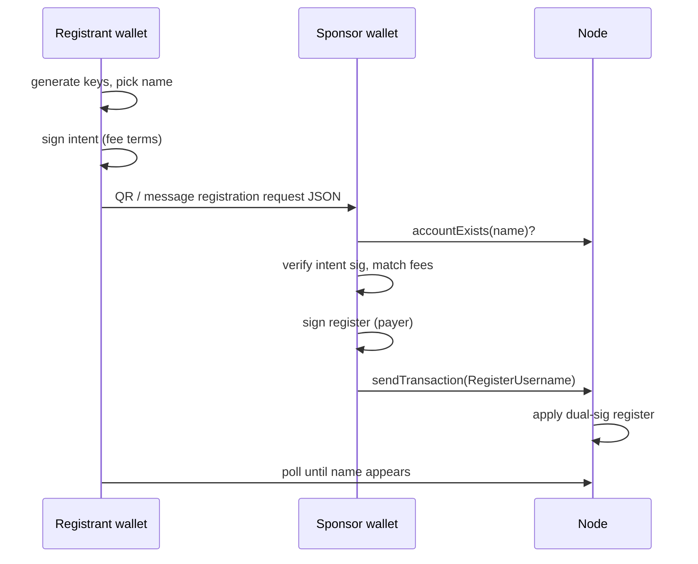

# Spec 16 — Sponsored registration (pay-for-name)

**Status:** draft  
**Related:** [`03-transactions.md`](03-transactions.md) §3.1, [`07-fees-and-tokenomics.md`](07-fees-and-tokenomics.md)

## 1. Problem

Guld names are the addressing layer: you cannot receive a `Transfer` until you have a registered name. Registration costs **`F_user(L)`** per year from the name’s letter count (spec 07; e.g. `bob` = 10 GULD/yr, ≥6 letters = 1 GULD/yr), plus optional endowment and inclusion fee. A **new user with no name and no GULD** cannot bootstrap alone.

**Solution:** split registration into a **contractual two-party** flow:

1. **Registrant** (future name holder) generates keys, picks an available name, and signs consent to exact terms.
2. **Sponsor** (existing account with GULD) pays fees and submits the on-chain `RegisterUsername` tx.

This is the primary bootstrap path for new humans joining the network (faucets, friends, registrars, employers).

## 2. On-chain tx (unchanged shape, dual signature)

```text
RegisterUsername {
  payer: Name,                    // sponsor — existing account
  name: Name,                     // new — MUST NOT exist
  keys: Vec<Pubkey>,
  threshold: u16,
  initial_master_hash: Hash32,
  endowment: Amount,
  payer_signature: Signature,     // over guld/register/v1
  registrant_signature: Signature,// over guld/register/intent/v1
  inclusion_fee: Amount,
}
```

**Both signatures are mandatory.** A payer alone MUST NOT be able to register arbitrary keys for a name; a registrant alone MUST NOT be able to spend someone else's GULD.

## 3. Messages

### 3.1 Registrant intent — `guld/register/intent/v1`

Binds the name, keys, and fee terms **without** a payer (any sponsor may fulfill).

```text
payload = name UTF-8
       ‖ 0x00
       ‖ threshold u16 BE
       ‖ initial_master_hash 32 bytes
       ‖ endowment u128 BE
       ‖ registration_fee u128 BE   // F_user or F_group (fixed) at apply height
       ‖ inclusion_fee u128 BE
       ‖ keys[0] ‖ keys[1] ‖ …     // raw 32-byte pubkeys in order

intent_hash = SHA256("guld/register/intent/v1" ‖ 0x00 ‖ payload)
```

`registrant_signature` MUST verify under `keys[0]`.

### 3.2 Sponsor spend — `guld/register/v1`

Same fields as today, plus payer identity and nonce:

```text
payload = payer_account_id 32 bytes
       ‖ payer_nonce u64 BE
       ‖ (same tail as intent from name onward)

register_hash = SHA256("guld/register/v1" ‖ 0x00 ‖ payload)
```

`payer_signature` MUST verify under payer's current spend key (`keys[0]` when threshold == 1).

**Consistency rule:** the intent tail MUST match the register tail exactly (name, threshold, master, endowment, registration_fee, inclusion_fee, keys). Nodes MUST reject if they differ.

## 4. Off-chain registration request

Wallets SHOULD exchange a portable JSON blob before submission:

```json
{
  "version": 1,
  "type": "register_username",
  "name": "carol",
  "keys": ["0x…"],
  "threshold": 1,
  "initial_master_hash": "0x…",
  "endowment": "0",
  "registration_fee": "10000000000",
  "inclusion_fee": "0",
  "height": "42",
  "registrant_signature": "0x…"
}
```

| Field | Meaning |
|-------|---------|
| `registration_fee` | `F_user(h)` (or `F_group`) the registrant accepted |
| `height` | Optional hint when estimate was taken |
| `registrant_signature` | Over intent at listed terms |

**Sponsor checks before signing:**

1. Name still available (`guld_accountExists` → false).
2. `registration_fee` equals current chain estimate at inclusion height (reject stale requests).
3. `registrant_signature` verifies under `keys[0]`.
4. Optional off-chain policy (KYC, payment, invite code) — **out of consensus**.

## 5. Flows

### 5.1 Self-service (has GULD)

User with an existing funded account registers a **new** name (same device signs both roles):

1. Generate fresh key for new name.
2. Sign intent with new key; sign register with payer key.
3. Submit tx.

### 5.2 Sponsored bootstrap (no GULD)



**In-person handshake:** registrant shows a QR whose payload is `guld1reg:` + compact JSON (same fields as §4). Sponsor pastes or scans into **Sponsor a name**, verifies, and pays. Remote: copy/paste the pretty JSON via chat.

After inclusion, registrant controls the name via keys they generated locally. Sponsor never receives the private key.

### 5.3 Provider models

| Provider | Role |
|----------|------|
| Public faucet | Sponsors + optional small endowment |
| Friend / employer | Sponsors after off-chain agreement |
| Commercial registrar | Off-chain payment (any peer + third-party gateway) → sponsor tx |
| Legacy claim | Separate path — `ClaimLegacy` unlocks imported name without new registration |

**Any funded account** MAY run a commercial registrar by wiring a supported payment provider and fulfilling registration-request JSON — including everyday users, not only guld.io / isysd. That is an instance of this row, not a consensus role — see [`../intents/bootstrap-gateway-registrar.md`](../intents/bootstrap-gateway-registrar.md).

## 6. Security properties

| Property | Mechanism |
|----------|-----------|
| Registrant chooses keys | Intent sig under `keys[0]` |
| Sponsor chooses payer | Payer sig binds payer nonce + balance |
| No fee bait-and-switch | Intent locks `registration_fee`, `endowment`, `inclusion_fee` |
| No name squat by sponsor | Sponsor cannot change name/keys after intent |
| Stale fee rejection | Sponsor MUST compare `registration_fee` to current `F_*` |

## 7. Component API

```text
fn register_intent_message(...) -> Hash32;
fn register_message(payer, ...) -> Hash32;
// apply_register verifies both before state change
```

Wallet client messages (reference UI):

| Message | Purpose |
|---------|---------|
| `BUILD_REGISTRATION_REQUEST` | Registrant → signed JSON |
| `SPONSOR_REGISTRATION` | Sponsor → on-chain tx |
| `SEND_REGISTER` | Self-service dual-sig register |

## 8. Open parameters

- Optional `sponsor: Name` field in intent to restrict who may pay (future)
- Intent expiry / max height window (future)
- Group registration request profile (`register_group`)
