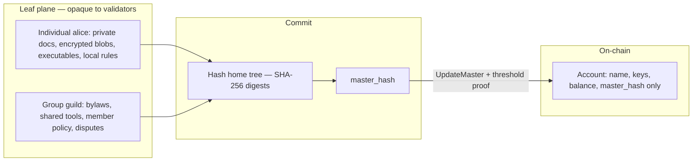
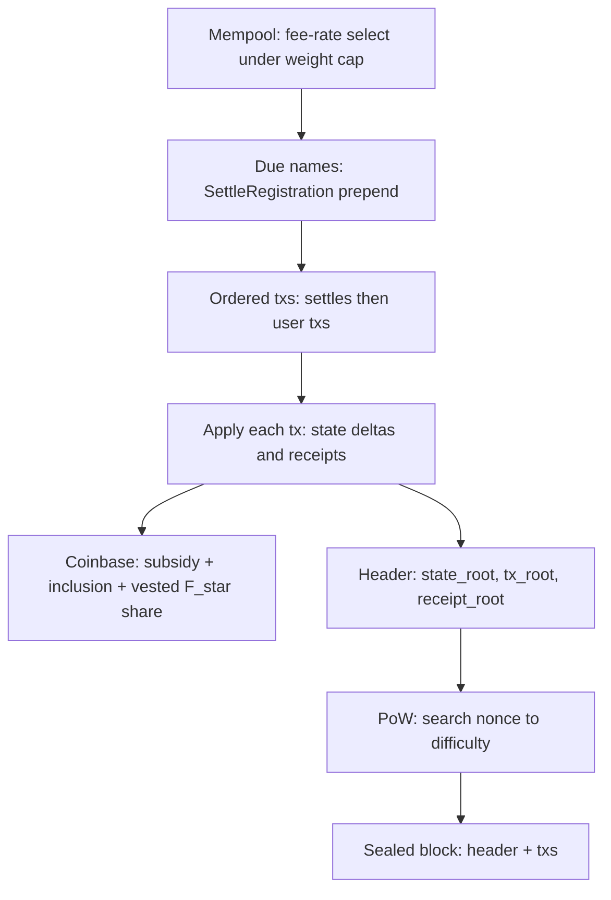

# Guld 2.0 Whitepaper

**Version:** 0.19  
**Date:** 2026-09-24  
**Token:** GULD (native)  
**Specifications:** [`../specs/README.md`](../specs/README.md) · **Glossary:** [§14](#14-glossary)

---

## Abstract

Guld 2.0 is a **global, identity-focused DeFi layer-0**: a **PoW-anchored namespace and witness substrate** where people, groups, **other blockchains**, and unbounded dapps share one address space of **usernames**, **content hashes**, and **enumerated proofs**. The chain records that an account achieved consensus on a new **head** (master hash). It does not interpret why they signed, run their private scripts, or adjudicate their disputes.

Other networks (e.g. **`ethereum`**, **`solana`**, **`bitcoin`**) MAY appear as names whose tips advance under **those chains’ consensus proofs**. Dapps such as a hypothetical **guldex** can build further proofs over those witnessed states; “lightning”-style or personal chains can settle periodically by committing hashes to Guld. The network is **not a general VM**: it validates fixed transaction schemas, checks hashes and signatures, and applies a small set of built-in state updates. **Everything else**—games, exchanges, rollups-as-leaves, agents—lives in **leaves**, on custom domains. Clients talk to full nodes only over the node’s **HTTP API** or **JSON-RPC** (or a proxy in front)—not consensus opcodes. Between leaves, dapps coordinate however they choose (HTTPS, IPC, in-process, …). Validators stay lean on keys, tips, and balances. Optional git and PGP remain **leaf** tools, not the consensus bus.

Fees follow a **Bitcoin-style weight market** (GULD per virtual byte), not an EVM gas ISA. Emission and PoW (or DAG-PoW) align open membership with scarce block space. Each account is responsible for what it **witnesses** and **cowitnesses**.

---

## 1. Motivation

### 1.1 The gap

Ethereum proved programmable settlement and fee markets. Bitcoin proved open Sybil-resistant consensus. Solana proved that non-conflicting account updates can proceed in parallel. None of them treat **human-meaningful identity** and **sovereign group process** as the primary object:

- Addresses are opaque key hashes, not names.
- “Multisig” and governance are applications, not the native tip model.
- Putting social process on a general VM forces every validator to re-execute politics—or forces that politics into custodial apps.

Guld 1.0 explored identity, git, and weighted observation. Solving network consensus **inside** git and PGP proved too bloated for global scale (emails and UIDs as metadata, weak first-class cosign, mega-repo growth).

### 1.2 Thesis

**Address by name. Commit by hash. Authorize by proof. Pay a tx fee. Leave leaf law to the leaf — including dapps with no ceiling. Witness other chains the same way.**

Guld is an **L0 witness hub**: identities and foreign networks share one namespace; settlement of fast paths and personal chains is “just another hash tip.” It is a hard fork of the 1.0 software and ledger: preserve historical balances and rules where possible; do not preserve blockchain-in-git or FUSE as the product model.

### 1.3 Design bar

| Goal | Meaning |
|------|---------|
| **L0 substrate** | Names + proofs + PoW anchoring under people, groups, **and other chains** |
| Identity-first DeFi | Transfers, bonds, grants, and permissions bind to **usernames / groups** |
| Flexible leaves / dapps | **No app ceiling** — leaves run any stack; Guld only witnesses heads |
| Foreign-chain proofs | Tips for `ethereum` / `solana` / … under **their** consensus proofs ([`../specs/13-foreign-chains.md`](../specs/13-foreign-chains.md)) |
| Network as witness | Verifies external proofs and records heads — does not re-execute app logic |
| PoW security class | Open membership and scarce block space in the BTC/ETH/SOL security conversation |
| Lean validators | No requirement to index social graphs or execute leaf interpreters |

### 1.4 Target user story

This is the product journey the reference stack optimizes for:

1. **Hear about Guld** — word of mouth, dapp, docs, or press.  
2. **Arrive** — open **guld.io** (bootstrap mirror) **or** install/run Guld software from source (`guld-node` + static wallet).  
3. **Create identity** — generate a key on-device, pick an **available name**, see the **estimated GULD registration fee** (`F_user(L)` + inclusion).  
4. **Get sponsored** — **guld.io** (or any paid registrar) takes off-chain payment, **or** someone they know sponsors on-chain (spec 16). Dual signatures; user keeps the private key.  
5. **Live in the PWA wallet** — installable on device; keys stay local (encrypted); user can **transact** (send to names) and **build their own dapp** under their home tip.  
6. **Link ecosystem tools** — especially a **browser extension** that holds/uses the same identity so the user can **log into websites** with their Guld name/key (challenge–response / signed auth — leaf/app convention, not a consensus opcode).  
7. **Browse the ecosystem** — visit many **Guld dapps** on many domains with **one key, one passphrase habit, one name** — no per-site hex wallets.

Steps 6–7 are **ecosystem UX** (extension and dapp conventions). They are not required for consensus validation; they are required for the intended everyday experience. Friend-only sponsorship and “build from git, never visit guld.io” remain fully valid.

---

## 2. Architecture overview

```
┌─────────────────────────────────────────────────────────────┐
│  Consensus plane                                            │
│  PoW / DAG-PoW headers · fork choice · coinbase · fees      │
└────────────────────────────┬────────────────────────────────┘
                             │ commits to state_root
                             ▼
┌─────────────────────────────────────────────────────────────┐
│  State plane (KV + sparse Merkle / authenticated tree)      │
│  username → account · keys · threshold · master_hash        │
│  balances · nonces · receipts                               │
└────────────────────────────┬────────────────────────────────┘
                             │ references content hashes
                             ▼
┌─────────────────────────────────────────────────────────────┐
│  Object plane (CAS + optional git remotes)                   │
│  personal / group trees · forge clones · encrypted blobs    │
│  local/optional retention · leaf hosts materialize clients  │
└─────────────────────────────────────────────────────────────┘
                             │
                             ▼
┌─────────────────────────────────────────────────────────────┐
│  Clients (unknown) + optional indexers                      │
│  Browser / game / CLI ↔ node (HTTP · JSON-RPC) · leaf · index│
└─────────────────────────────────────────────────────────────┘
```

**Stack:** Rust validator; polyglot leaf tooling (including Python/JS meta-FS packages as leaf hosts). Users may push leaf git to GitHub or any forge for free distribution. SHA-256 for commitments; **AES-256 only in the reference wallet** (key encryption at rest — not leaf/CAS content); account signatures Ed25519 at genesis with a documented PQ migration path (hybrid / ML-DSA). Leaf bytes are opaque; owners may encrypt locally with any tool.

**Node surfaces:** **P2P** is the primary mesh among full nodes (blocks, txs, CAS). Wallets and dapps talk to a node only via its client APIs: canonical **HTTP** (`/api/v1/…`) and **JSON-RPC** (or a reverse proxy in front of those)—typically the user’s own node. Nodes do **not** expose IPC or embed app logic; libraries such as **`guld-client`** are client-side helpers that still speak HTTP/RPC to a node. **Dapp-to-dapp** coordination is separate: leaves MAY use any transport between themselves (HTTPS between domains, IPC, in-process calls, …)—e.g. a Guld lightning group calling a guldex group over HTTP to settle instantly—then each posts proof-bearing txs to a node when L0 settlement is needed. The reference static wallet is the **guld git tree itself** (served via `--http-static` or any static host) and may be mirrored on a domain such as guld.io — that domain is a **bootstrap URL**, not a consensus hub.

---

## 3. Identity model

### 3.1 Names and hashes

| Concept | Role |
|---------|------|
| **Username / group name** | Human-addressable primary handle on the network |
| **Account id** | Stable internal id (hash of registration commitment) |
| **Master hash** | Single SHA-256 committing to the account’s defined tree + meta |
| **Content hashes** | SHA-256 (or tree roots) referencing CAS objects |

People say: *pay `alice`*, *bond to `guild/traders`*, *follow tip of `bob`*. Machines settle against the registered mapping and the current master hash.

### 3.2 Account structure and network-level home

```
name
├── keys[]              # verification keys
├── threshold           # cosign policy for tip / spend / recover (roles optional)
├── nonce
├── master_hash         # SHA-256 head of the account home
├── balance (GULD)
└── optional bond / remote-hint fields   # bonds = roles/deposits only; no L0 CAS pins
```

```
master_hash = SHA256(
  home_tree_root ‖          # SHA-256 Merkle (or equivalent) of defined home objects
  account_meta_root ‖
  … schema-frozen fields …
)
```

**Primary homes are hash trees at the network layer**, not git objects. The chain stores the **identity record** (name, keys, threshold, `master_hash`, balances)—that is the network’s primary identity file. Home **bytes** live in CAS addressed by SHA-256. Validators need only the tip for validation; **content retention is a leaf concern** (self-host, forge mirrors, leaf contracts)—not an L0 pin market, including account **`guld`** (§3.5).

**Leaf formats under the home** (git repos, game data, HTTP app trees, encrypted blobs, …) are optional and opaque. Git is a fine leaf encoding for free forge hosting; it is **not** the network home format. Other leaf formats—including as the bulk of a personal or group home—are first-class as long as the committed root is SHA-256.

Validators never open leaf formats; they only check that proofs authorize a new `master_hash`.

### 3.3 Registration (priced; anti-spam)

Registering a name consumes **global namespace** and creates durable validator state. It must be **painful to spam**, continuing the Guld 1.0 idea of explicit registration fees for individuals and groups.

| Kind | Who pays | Fee (consensus) |
|------|----------|-----------------|
| **Individual** | Payer account | **`F_user(L)`/year** — letter-based; 1-letter names premium, ≥6 letters = **1 GULD** floor **plus** inclusion fee |
| **Group** | Payer account | **`F_group(L, n) = F_user(L) × (2 + n)` GULD**/year (`L` = letters in root name; `n` = initial signer count) **plus** inclusion fee |
| **Subaccount** | Parent individual | **`F_sub = 0.1 GULD`/year** fixed **plus** inclusion fee — `parent.label` device / hot-cold wallets |

**Why scale group fees with signer count:** each additional key enlarges proofs the network must verify for the life of that account (registration now; every threshold tip later). Charging upfront for `n` aligns payment with **proof complexity** the validators will perform.

**Length pricing:** count **letters only** in the root label (`x` = 1, `jorge-luise-gonzalez` = 17 → capped). Short names are scarce and expensive; names with **≥ 6 letters** pay the **1 GULD**/year floor (1.0 continuity for ordinary names). Subaccounts stay cheap so one human can hold multiple custody zones without burning another top-level name. Fees buy **DNS-style pay-or-release** control ([`../gips/gip-11.md`](../gips/gip-11.md)); keep the wallet funded or the name is released. Legacy claims stay open (PGP or isysd attestation). No resale market. See §8.7 and [`../specs/07-fees-and-tokenomics.md`](../specs/07-fees-and-tokenomics.md).

**Miner lottery (8-block vest):** `F_user(L)`, `F_group(L, n)`, `F_sub`, and settle renewals/releases are debited in full at apply, then **credited to miners over 8 consecutive blocks** starting at the inclusion height (`REGISTRATION_FEE_VEST_BLOCKS = 8`). The including miner receives only ~1/8 in that block's coinbase; recovering the full fee requires winning all eight. No burn. Inclusion fees stay one-shot to the including miner. Optional **name deposits** may lock separately (returnable/slashable under policy).

**Bootstrap (no name yet):** registration requires a **sponsor** with GULD. The future name holder signs a **registration intent** (`guld/register/intent/v1`); the sponsor signs the spend (`guld/register/v1`). Both signatures are required on-chain — see [`../specs/16-sponsored-registration.md`](../specs/16-sponsored-registration.md).

A sponsor is usually a **friend** (or any funded account). Anyone with GULD MAY also run an **optional paid registrar**: the newcomer pays via a **third-party payment service** (BTC/ETH/SOL/USDT/fiat); after payment, automation submits the **same** sponsor tx. Early on, guld.io / **isysd** may be a convenient first desk — not a privileged one. Everyday users can turn the same feature on against their own node. The desk is **not** consensus authority, **not** required to join, and **turn-offable**. The first user can still build from git and never visit guld.io. See [`../gips/gip-8.md`](../gips/gip-8.md).

```
RegisterUsername / RegisterGroup(
  name, keys[1..n], threshold, initial_master_hash
)  requires  balance ≥ F_*(n) + endowment + inclusion_fee
           F_*(n) → vested miner credits over 8 blocks; inclusion_fee → including miner
```

Legacy Guld 1.0 usernames and balances are imported as **claimable pre-mine accounts** (§8.6, [`../specs/15-ledger-import.md`](../specs/15-ledger-import.md)). Spend and tip authority activate only after a **key upgrade**: the holder proves control of the 1.0 identity (PGP / legacy binding) and registers Ed25519 (or hybrid) keys. Until then, balances are respected on-chain but **locked**. OpenPGP is not the hot verify path after claim.

### 3.4 Addressing, referencing, and L0 foreign chains

- **Address by name** in UX and high-level txs (`Transfer { to: "alice", amount }`).
- **Reference by hash** for tips, trees, and proofs (`master_hash`, CAS oids).
- Resolvers and indexers may cache name→id; consensus stores the authoritative map.

**Foreign chains in the namespace.** Names such as **`bitcoin`**, **`ethereum`**, **`solana`**, … MAY be reserved (or later gated) as **`foreign_chain`** accounts. Their `master_hash` tips advance only with **enumerated proofs that invoke that chain’s consensus rules** (SPV / light-client style)—not Guld cosign alone. Guld nodes verify those proofs at bounded weight cost; they **MUST NOT** be required to run full foreign nodes.

That is the L0 move: **one identity and tip layer that can witness many networks’ outcomes**. It is **not** automatically a token bridge (lock/mint is a separate product). Full rules: [`../specs/13-foreign-chains.md`](../specs/13-foreign-chains.md).

**Dapps on top of witnessed foreign state.** A third-party leaf such as a hypothetical **guldex** MAY read those tips (and related home documents), build **application proofs** about foreign balances or events, and settle its own state by advancing **its** name’s tip—or by posting ordinary Guld txs. Guld does not need a special “exchange opcode”; guldex is a dapp with keys, a home tree, and whatever off-chain indexing it needs.

**Fast paths and personal chains are trivial in this toolset.** Identities, keys, threshold cosign, and PoW-anchored tips already give you:

| Pattern | How it maps |
|---------|-------------|
| **Personal / app chain** | A name (or group) whose leaf is a ledger; periodic `UpdateMaster` commits the latest state root to Guld |
| **“Lightning”-style channels** | A dapp keeps off-Guld updates among parties; periodically settles a hash (and optional proofs) to Guld — and MAY interact with guldex or foreign-chain tips for multi-asset stories |
| **Side systems / rollups-as-leaves** | Same: fast execution off the witness hub; hash commitment on Guld when you need global finality under PoW |

The main Guld chain stays a **scarce, weight-priced settlement and naming plane**. Speed and experimentation live in leaves that **checkpoint** here.
### 3.5 Reserved name: `guld` (network identity)

The username / account **`guld`** is **reserved for the network itself**. It is not available for public registration.

Its on-chain home tip commits to a compact **rule bundle**—schemas, genesis params, weight tables, proof-kind definitions—that honest nodes enforce. That is the network’s normative **parameter set**, not a mirror of developer source repositories.

**Node software** (full node, wallet, leaf SDKs) ships from **ordinary git repos** maintained by operators (e.g. `https://guld.io/repos/guld.git`). Full nodes **do not** need to clone or materialize protocol **source code** from the `guld` CAS tree to validate blocks. Block headers carry **`guld_rules_hash`** (digest of the rule bundle **active at that height**); the node must know that digest and apply the matching logic ([`../specs/17-protocol-upgrades.md`](../specs/17-protocol-upgrades.md)).

```
on-chain account "guld"
  └── master_hash  →  rule params, schemas, fee tables (small normative bundle)
        └── NOT required: full node / wallet / website source trees
```

Consensus cares about the committed rule digest and registered keys under `guld`, not where engineers keep their checkouts.

**Implications**

| Topic | Rule |
|-------|------|
| Namespace | `guld` cannot be registered by users; genesis-created |
| Rules | Headers include `guld_rules_hash`; must match the rule bundle **active at that height** |
| Source code | Off-chain git — **not** consensus data availability |
| Upgrades | Height-activated: publish next bundle with `activation_height = H`; headers switch digest at H; ship matching node binary first ([`../specs/17-protocol-upgrades.md`](../specs/17-protocol-upgrades.md)) |
| Light clients | Trust headers / proofs; need not fetch `guld` home bytes |

---

## 4. Leaves, witnessing, and cowitnessing

### 4.1 Leaf sovereignty

A **leaf** is a personal home or group realm: its members may use any languages, scripts, and local rules. Disputes (“why we signed”) are resolved **inside** the leaf.



Individuals and groups may keep **private files**—including encrypted blobs and **executables**—under whatever leaf policy they choose (bylaws, scripts, runtimes). The network does not open those bytes. What enters consensus is only a **content-addressed tip**: hash the home tree → `master_hash`, then authorize `UpdateMaster` with an enumerated proof (usually threshold cosign). Any leaf format is valid so long as the committed head is a SHA-256 (or equivalent) hash.

The network accepts a tip update only if it carries an **enumerated, externally verifiable** leaf-consensus proof under the account’s current on-chain policy—for genesis, primarily:

**`threshold_cosign_v1`:** at least `threshold` signatures over

```
SHA256( account_id ‖ prev_master_hash ‖ new_master_hash ‖ nonce ‖ chain_id )
```

`nonce` is the account’s on-chain sequence number (starts at 0). It binds each tip advance to exactly one successor step: if two leaf processes race from the same head, only the first included `UpdateMaster` succeeds; the other’s cosignatures become stale and must be reissued after re-reading `(master_hash, nonce)` from a node. The same nonce also serializes spends and other account mutations — no merge at L0, only explicit ordering.

Additional proof kinds require explicit protocol upgrades.

### 4.1b Dapps: you can literally do anything

On most L1s, a “dapp” is trapped inside a **shared VM**: gas meters, opcode sets, and every validator re-executing your logic. That caps ambition—and taxes the whole network for your creativity.

**Guld inverts that.** A dapp is a **leaf** (or a composition of leaves) under one or more names. The chain only asks: *did the right keys authorize this new head, and was the fee paid?* It does **not** ask what the bytes mean.

So a Guld dapp MAY be:

- a static site or full **web app** on a **custom domain**, reading/writing L0 state through a node’s **HTTP API** or **JSON-RPC** (local or remote)  
- a **native game**, engine, or desktop binary loaded from the home tree  
- an **agent**, bot, notebook, or long-running service the leaf host starts  
- encrypted personal vaults, guild tooling, markets, social graphs, DAOs-as-process, research labs, art — **whatever the builders ship**  
- **cross-dapp** flows over **whatever transport fits between leaves** (HTTPS between domains, IPC, in-process, …)—e.g. lightning ↔ guldex settling off-L0—plus ordinary sponsored/paid registration and transfers when money or names must hit the chain  
- **foreign-chain witnesses** and settlement dapps (guldex, lightning-style channels, personal chains) that commit hashes to Guld (§3.4)

There is **no on-chain language whitelist**, **no gas ISA for app logic**, and **no requirement** that every validator understand your stack. Unsupported leaf types are still valid on-chain; clients that care materialize them; others ignore them.

**Expectation:** dapps on Guld should be **extreme**—far beyond “another Solidity CRUD front-end.” The protocol’s job is identity, money, and witnessed tips. The dapp’s job is the rest of the universe. If it can run on a computer and commit a hash under your keys, it can be a Guld dapp.

One common shape is web-native: users run (or trust) a node; the reference wallet is static files; dapps live on **their** domains; leaf peers coordinate however their stack requires; settlement stays proof-bearing txs on the **P2P mesh**.

### 4.2 Witness and cowitness responsibility

| Actor | Responsibility |
|-------|----------------|
| **Account / key holder** | Whatever they sign: they **witness** that `new_master_hash` is the authorized head |
| **Cosigners** | Jointly **cowitness** the same statement; threshold failure ⇒ tip rejected |
| **Validators / miners** | Witness that the proof verifies and the fee is paid; they do **not** endorse leaf politics |
| **Leaf hosts / remotes** | Hold bytes clients need; availability is **off** the consensus path (leaf contracts, self-host, forges) |

Signing is **attributable**. Social or legal meaning of a cowitness remains a leaf concern; cryptographically, cowitnesses are jointly necessary for the tip to enter global history.

### 4.3 What the node does *not* do

- Run leaf interpreters as a consensus requirement (Python, WASM guild scripts, games, …)
- Read emails, PGP UIDs, or git commit headers as consensus input
- Decide internal group disputes
- Require a global metadata index to produce blocks

### 4.4 Clients, leaf hosts, and free git remotes (UX)

The **ultimate client is undefined**: a browser UI, a native game binary, a CLI, a mobile app, an agent. **Guld only knows names and heads.** To *use* files and code, a client must talk to something that holds **leaf material**—not merely the on-chain `master_hash`.

```
  unknown client (browser / game / CLI / …)
           │
           ▼
  leaf host  ←── full node software can provide this as a local/remote service
  (clone, serve files, run optional leaf runtime)
           │  push / fetch git or CAS
           ▼
  leaf remotes (often free): GitHub, Forgejo, self-host, …
           │  announce new tip
           ▼
  network validators  (verify proof + fee; store master_hash only)
```

**Git as empowerment, not consensus bus**

- Individuals or groups can get **free git hosting** (e.g. GitHub) for their home or group branch.
- Whatever client they use can **push** there; peers and leaf hosts **clone/fetch** to distribute updates and to recompute or verify tree hashes that become the next `master_hash`.
- The network may **read** public remotes when helping users sync, but consensus does **not** require GitHub uptime, git commit metadata, or a particular forge—only a valid proof over the new head.
- Optional: account meta may list **hint URLs** (`remotes[]`) so clients know where to fetch; hints are convenience, not consensus truth.

**Runtime is leaf-defined — and unbounded**

A leaf might expose an HTTP server + browser UI, load a game binary, run notebooks, or stay static files — or invent something nobody has shipped yet. The full node package **may** start such services for supported leaf types; it is not obligated to understand every leaf. Unsupported leaves are still valid on-chain as long as heads and proofs verify. See **§4.1b**.

**“Connected to a node that supports their leaves”**

- Wallet-only clients can transfer GULD and read heads from any full node they reach via **HTTP API** or **JSON-RPC**—local or a remote peer they choose to trust for reads.
- **Contentful** clients need a **leaf host** (often the user’s own full node, or a hosted node they trust) that:
  - tracks network tip for their name/group  
  - materializes the matching tree (clone from remotes / CAS / pins)  
  - optionally runs the leaf’s chosen runtime  
- Full node software is the default way to get that host locally; third parties may offer “node-as-a-service” for specific leaf kinds without becoming consensus validators.

**Availability:** relying solely on a commercial forge is a **UX bootstrap**, not protocol DA. Serious leaves should mirror or self-host (or contract retention in-leaf); on-chain head can outlive a deleted GitHub repo.

### 4.5 Reference UI and guld.io

Reference clients ([`../specs/14-reference-ui.md`](../specs/14-reference-ui.md); GIP [`../gips/gip-5.md`](../gips/gip-5.md)):

| Surface | Role |
|---------|------|
| **Static webapp / PWA** (repo root) | **Primary** reference wallet — register, send, balance, activity, explorer, docs; installable cross-platform |
| **`guld-wallet` (desktop)** | Optional — file keyring, legacy PGP claim, external signing for users who keep keys off the browser |

**How it runs:** the wallet is **open-source static files in this repository** (no Node.js build). Each user SHOULD run it against **their own** `guld-node --http` (optionally `--http-static .`). The **guld.io** domain is a convenient **bootstrap URL** and one mirror of that software — not the only place wallets may live, and not a required peer for consensus.

**API:** the reference PWA uses the node **HTTP API** (`/api/v1/…`); desktop and server clients MAY use **JSON-RPC** (or libraries such as **`guld-client`** that speak those APIs). Nodes do not offer IPC. Writes are proof-bearing (signed txs); the node MUST NOT store user keys.

**Target journey:** §1.4 — hear about Guld → wallet → name + fee → sponsor → installable PWA → extension login → many dapps, one identity. Rust **`guld-client`** backs the desktop signer; the PWA uses JS/WASM signing aligned to the same message formats. A **browser extension** is the preferred bridge for “log into this website as `alice`”; it is ecosystem software (not consensus), but it is part of the **target** everyday path alongside the PWA.

### 4.6 Optional paid registrar (any peer)

The bottleneck for a newcomer is finding someone with GULD to sponsor a name. **Any funded account** MAY enable a **paid registrar** in the reference software: connect a **supported third-party payment gateway**, publish a pay link, and on webhook fulfillment submit the portable registration request as payer — identical to friend-sponsor on-chain ([`../gips/gip-8.md`](../gips/gip-8.md)).

guld.io / **isysd** may run this **first** during bootstrap. That does **not** reserve the role:

- Everyday users can turn the same feature on for their own name and domain or localhost mirror.  
- Friend-sponsor without payment remains fully supported.  
- Consensus peers are full nodes over P2P, not payment vendors.  
- Anyone can turn their desk **off**, or use a dedicated self-funding registrar account — no protocol change.

Payment rails and gateway UI are **out of protocol**. They MUST NOT be required by `guld-node` validation.

---

## 5. Network validation (not a VM)

The Guld chain is intentionally **not** a programmable machine for app logic. It may:

- validate fixed **schemas** for a closed set of tx types  
- check **hashes**, **signatures**, and enumerated **leaf-consensus proofs** (including **foreign-chain** proof kinds)  
- apply **built-in** balance/tip/key updates  

It does **not** host user-defined functions, loops, or leaf languages. Those run only in leaves — which is exactly why dapps are unbounded (§4.1b) and why other chains / fast paths settle as **tips** (§3.4). That is why Bitcoin-style tx fees fit and an EVM gas ISA does not.

---

## 6. Transaction types (network surface)

| Tx | Effect |
|----|--------|
| `RegisterUsername` | Bind individual name; pay `F_user(L)` + inclusion fee |
| `RegisterGroup` | Bind group name with `n` signers; pay `F_group(L, n)` + miner fee |
| `RegisterSubaccount` | Bind `parent.label`; pay `F_sub` + inclusion fee |
| `RotateKeys` | Change keys/threshold (own key hygiene — not resale); dual auth old+new; **group key-set growth** pays `F_group` delta |
| `SettleRegistration` | Pay-or-release at expiry: auto-debit `F_*` or delete name (miner) |
| `UpdateMaster` | Advance `master_hash` with leaf-consensus proof |
| `Transfer` | Move GULD between named accounts |
| `ClaimLegacy` | Unlock a 1.0-imported name under new keys |
| `Bond` / `Unbond` / `Slash` | Optional stake for **roles / name deposits**—**not** CAS storage |

All fee-paying txs MAY carry an optional **`memo`** (≤ **64** bytes): opaque correlation data (payment order id, invoice tag). Consensus does not interpret it; weight includes every byte. `SettleRegistration` omits memo. Spec: [`../specs/03-transactions.md`](../specs/03-transactions.md) §2.1.

All txs pay a **weight-based fee**. Conflict sets are account ids touched; non-overlapping updates may execute in parallel within a block.

---

## 7. Consensus

### 7.1 Role of PoW

Open membership for block proposal uses **PoW or DAG-PoW** on headers that commit to:

- `prev` / DAG parents  
- `state_root`  
- `tx_root`  
- `receipt_root`  
- `difficulty` / `nonce`  
- `coinbase` (PQ-ready reward address)  
- `fee_total` / block weight used  

Useful validation (schema + proof verify + state transition) is **eligibility**. PoW elects among valid candidates and prices Sybil proposal spam. DAG-PoW variants may raise parallel block throughput without abandoning PoW’s open-entry property.



**Block construction (miner path):** select mempool txs by fee rate under the weight cap; prepend permissionless `SettleRegistration` for names due at this height (pay-or-release); apply every tx to produce receipts and fee totals; schedule registration/settle fees into the 8-block vesting queue; credit **coinbase** = subsidy + inclusion fees + this height's vested registration share; fill header roots; search a PoW nonce. Peers re-apply the same txs—they never execute leaf code inside the block.

### 7.2 Finality

Probabilistic depth (Nakamoto / GHOSTDAG-class). Optional later checkpoints are a separate discussion.

### 7.3 Relation to stake

Bonded GULD may gate name deposits or future attestor roles. **CAS retention is not bonded at L0.** Tip election is **not** PoS; weights live at the **account cosign** layer and optional bonds, not as a replacement for header PoW.

---

## 8. Tokenomics and fees

The network has a **fixed transaction vocabulary**. There is no user-defined opcode meter and no general-purpose on-chain VM. Validation is: parse schema → check hashes/sigs/proofs → apply built-in delta. That matches a **Bitcoin-style fee market** better than Ethereum gas.

### 8.1 Native asset: GULD

| Use | Description |
|-----|-------------|
| **Transaction fees** | Weight-priced inclusion fees → **miners** |
| **Registration fees** | `F_user(L)` / `F_group(L, n)` / `F_sub` → **block miner** (§8.7; anti-spam lottery) |
| **Name deposits** | Optional extra lock on top of registration |
| **Transfers / DeFi** | Settlements between named identities |
| **Miner rewards** | Block subsidy (PoW issuance) + inclusion fees + registration fees |

Hard fork from 1.0: import every positive `*:Assets` balance from `archives/ledger-guld` as genesis pre-mine **x**, then unlock per name via **key upgrade** (spec: [`../specs/15-ledger-import.md`](../specs/15-ledger-import.md); GIP: [`../gips/gip-14.md`](../gips/gip-14.md)). See §8.6.

### 8.2 Why not an EVM-style gas ISA

| EVM gas | Guld network |
|---------|----------------|
| Meters arbitrary script steps | No custom functions at L0 |
| `gas_limit` / opcode schedule | Fixed tx kinds; cost ≈ size + sigs |
| Complex refunds / metering bugs | Simple weight policy |

Leaf runtimes may invent their own internal metering; Guld never sees it.

### 8.3 Weight (virtual size)

Each tx has a **weight** in virtual bytes (vB), in the spirit of Bitcoin:

```
weight(tx) = size_bytes(tx)
           + W_sig × n_signatures
           + W_extra_account_write × max(0, n_writes - 1)
```

Registration also charges a separate **protocol fee** in GULD (`F_user(L)` or `F_group(L, n)`), not only weight—see §3.3. Weight still grows with `n_signatures` so ongoing tips from large groups stay costly to include.

**Weight constants** (genesis / soft-fork adjustable):

| Term | Value | Rationale |
|------|-------|-----------|
| Serialized bytes | 1 weight unit / byte | Bandwidth + storage in block |
| `W_sig` | 64 vB per signature | Dominant verify cost |
| `W_extra_account_write` | 50 vB | Extra state leaves (e.g. transfer touches 2) |

**Registration protocol fees** (locked structure; see §8.7 and [`../specs/07-fees-and-tokenomics.md`](../specs/07-fees-and-tokenomics.md)):

| Fee | Formula (per year) |
|-----|---------|
| `F_user(L)` | **1k / 100 / 10 / 5 / 2 / 1 GULD** for L = 1..5, **≥6** (see spec 07) |
| `F_sub` | **0.1 GULD** (fixed) |
| `F_group(L, n)` | **`F_user(L) × (2 + n)`** GULD |

Signatures in the tx body already add `size_bytes`; `W_sig` is an **additional** CPU surcharge so large cosign sets remain expensive every tip—not only at registration.

**Examples**

| Tx | Approx size | Sigs | Writes | Weight | Protocol fee |
|----|-------------|------|--------|--------|--------------|
| `UpdateMaster` (1-of-1) | 200 B | 1 | 1 | ≈ **264 vB** | — |
| `UpdateMaster` (3-of-5) | 400 B | 3 | 1 | ≈ **592 vB** | — |
| `Transfer` | 150 B | 1 | 2 | ≈ **264 vB** | — |
| `RegisterUsername` | 250 B | 1 | 1 | ≈ **314 vB** | **`F_user`** |
| `RegisterGroup` (n=5) | 400 B | 5 | 1 | ≈ **720 vB** | **`F_group(L, 5)`** |

### 8.4 Fee market (Bitcoin-style)

Users attach `fee` in GULD (or `fee_rate` × weight):

```
inclusion_fee ≥ fee_rate_min × weight(tx)     # policy / relay floor
inclusion_fee → miner who includes the tx

registration_protocol_fee F_*(n) → miners over 8 blocks   # vest from inclusion height
```

- **Inclusion fees** go to the miner who includes the tx (Bitcoin-like weight market).  
- **Registration protocol fees** vest over **8** consecutive blocks so a self-dealing miner cannot pocket the full `F_*` in one win.  
- Mempool orders by **fee rate** (GULD / vB), same intuition as sat/vB.  
- Blocks have a **weight limit** (**4_000_000** weight units / block—BTC-order).  
- Miners maximize total revenue (inclusion + vested registration shares) under the weight cap among valid txs.

Congestion ⇒ users raise `fee_rate`. No opcode schedule to maintain.

### 8.5 Block capacity (order of magnitude)

If average tip update ≈ 300 vB and block weight limit = 4 M:

| Effective blocks/sec | Tip updates/sec (order) |
|----------------------|-------------------------|
| 0.1 | ~1 300 |
| 1 | ~13 000 |
| (DAG parallel blocks) | higher; specify in client |

Sig-heavy tips consume more weight → self-limit. Target remains **PoW base-layer class**, not Visa.

### 8.6 Supply, pre-mine, and issuance

#### Pre-existing GULD as genesis pre-mine

**Snapshot source:** `archives/ledger-guld` — per-user ledger-cli journals (`*.dat`), concatenated in timestamp order into a single journal (working copy `archives/guld-ledger-all.dat` alongside a flat balance dump). Period covered: **2016-06-01 → 2018-12-09**.

**Amount precision:** the 1.0 journal uses at most **10 decimal places** in any `GULD` amount. Freeze: **10** decimals (1 GULD = 10¹⁰ quanta).

Let **x** = total GULD imported at genesis = sum of positive member `name:Assets` roots:

| Quantity | GULD (working) |
|----------|----------------|
| **x** = member circulating / claimable | **≈ 959,947.19527052** |

**Not imported:** `guld:Assets:ERC20` and other protocol-side ERC20 mirror buckets (barely used in 1.0; omitted from the pre-mine).

Notes from the same pass:

- **≈ 2,217** names with positive `Assets`; ~15 names with negative `Assets` summing to ≈ **−1,028** GULD (import as **0**; list in the genesis anomaly appendix).
- Top holders (share of **x**): mizim ≈ 37%, isysd ≈ 9%, cz ≈ 4%, raadyx ≈ 3%, tigoctm ≈ 3%, then betatown, zimmi, aehaynes, torvalds, minotaur (~1% each). Top 10 ≈ **63%** of **x**.

```
circulating_supply(0) = x ≈ 959_947.20 GULD   // claimable by 1.0 names; legacy-locked until key upgrade
```

#### Respect balances; unlock via key upgrade

**Invariant:** every positive 1.0 `Assets` balance is imported 1:1. No haircut, no silent consolidation, no reassignment of names.

Import creates **legacy-locked** accounts: balance is on-chain, but `Transfer`, tip spend, and ordinary `RotateKeys` are disabled until the owner completes a **key upgrade** (`ClaimLegacy` — [`../specs/15-ledger-import.md`](../specs/15-ledger-import.md)):

1. Prove control of the 1.0 identity: **PGP** if `keys-pgp` has a binding, else **`isysd` attestation** for unbound names/groups.
2. Record Ed25519 (or hybrid) keys + threshold; clear the legacy lock; start a normal 1y registration period.
3. Thereafter the account is a normal 2.0 individual with yearly settle; further rotations use `RotateKeys`. Claims stay open indefinitely for never-claimed locked names.

Unclaimed balances remain in the owner's name; they count toward **x** but do not move without a valid claim. From genesis forward, **new** GULD enters only via the **block subsidy**.

#### Block time

**Target block interval: 10 minutes** (600 s) — Bitcoin-class. Comfortable for identity tips and weight-priced inclusion; keeps header/PoW overhead modest.

```
TARGET_BLOCK_INTERVAL = 600        // seconds
BLOCKS_PER_YEAR       = 52_560     // 365 × 144
```

Retarget keeps mean interval near target (see [`../specs/06-blocks-and-consensus.md`](../specs/06-blocks-and-consensus.md)).

#### Inflation schedule

Annual inflation rate **i(y)** (fraction of supply at the start of year **y**, y = 1 at genesis) decays by **two-thirds each year**, floored at **4%**:

```
i(y) = max(0.04, (2/3) ** (y - 1))   // y ≥ 1  →  1.00, ~0.667, ~0.444, … then 0.04
```

Year 1 opens at **100%** (doubles supply); year 2 ≈ **66.7%**; year 3 ≈ **44.4%**. The geometric term drops below 4% at year 9, so **i(y) = 4%** from year 9 onward (no cliff — continuous floor).

```
S(0) = x
annual_issuance(y) = S(y - 1) * i(y)
S(y) = S(y - 1) + annual_issuance(y)
subsidy(height) = annual_issuance(year(height)) / BLOCKS_PER_YEAR
```

`year(height) = floor((height - 1) / BLOCKS_PER_YEAR) + 1`. Within a year the per-block subsidy is **constant** (deterministic from genesis `x`). Consensus MUST embed the precomputed yearly per-block table (or an equivalent pure function of `height` and `x`).

**Why (2/3) decay:** a slower geometric path (e.g. 100%→4% over 20 equal log steps) stays too hot for a decade and mints ~150× **x**. Two-thirds decay still opens with a strong year-1 bootstrap, cools quickly through the early years, and reaches the **4%** security tail by year 9.

##### Rewards schedule (from genesis **x**; gross subsidy)

The following charts use the genesis pre-mine **x** from the 1.0 ledger import (ERC20 omitted). Exact values are pinned by the genesis manifest.

| Year | Inflation i(y) | Annual issuance (GULD) | Subsidy / block (GULD) | Supply end (GULD) | Supply / x |
|------|----------------|------------------------|------------------------|-------------------|------------|
| 1 | 100.00% | 959,947.20 | 18.263836 | 1,919,894.39 | 2.000× |
| 2 | 66.67% | 1,279,929.59 | 24.351781 | 3,199,823.98 | 3.333× |
| 3 | 44.44% | 1,422,143.99 | 27.057534 | 4,621,967.98 | 4.815× |
| 4 | 29.63% | 1,369,471.99 | 26.055403 | 5,991,439.97 | 6.241× |
| 5 | 19.75% | 1,183,494.32 | 22.517015 | 7,174,934.29 | 7.474× |
| 6 | 13.17% | 944,847.31 | 17.976547 | 8,119,781.60 | 8.459× |
| 7 | 8.78% | 712,847.77 | 13.562553 | 8,832,629.37 | 9.201× |
| 8 | 5.85% | 516,953.16 | 9.835486 | 9,349,582.53 | 9.740× |
| 9 | 4.00% | 373,983.30 | 7.115360 | 9,723,565.83 | 10.129× |
| 10 | 4.00% | 388,942.63 | 7.399974 | 10,112,508.46 | 10.534× |
| 11 | 4.00% | 404,500.34 | 7.695973 | 10,517,008.80 | 10.956× |
| 12 | 4.00% | 420,680.35 | 8.003812 | 10,937,689.15 | 11.394× |
| 13 | 4.00% | 437,507.57 | 8.323964 | 11,375,196.72 | 11.850× |
| 14 | 4.00% | 455,007.87 | 8.656923 | 11,830,204.58 | 12.324× |
| 15 | 4.00% | 473,208.18 | 9.003200 | 12,303,412.77 | 12.817× |
| 16 | 4.00% | 492,136.51 | 9.363328 | 12,795,549.28 | 13.329× |
| 17 | 4.00% | 511,821.97 | 9.737861 | 13,307,371.25 | 13.863× |
| 18 | 4.00% | 532,294.85 | 10.127375 | 13,839,666.10 | 14.417× |
| 19 | 4.00% | 553,586.64 | 10.532470 | 14,393,252.74 | 14.994× |
| 20 | 4.00% | 575,730.11 | 10.953769 | 14,968,982.85 | 15.594× |
| 21+ | 4.00% | 0.04 · S(y−1) | recomputed each year | +4%/yr | — |

Peak **per-block** subsidy is around year **3** (~27 GULD/block) as `S·i(y)` maximizes under the faster decay; after the 4% floor, block rewards rise slowly with supply.

##### Supply and inflation graphs

```mermaid
xychart-beta
    title Inflation rate i(y) — (2/3)^(y-1) floored at 4%
    x-axis [1, 2, 3, 4, 5, 6, 7, 8, 9, 10, 11, 12, 13, 14, 15, 16, 17, 18, 19, 20]
    y-axis "i(y) %" 0 --> 100
    line [100, 66.7, 44.4, 29.6, 19.8, 13.2, 8.8, 5.9, 4.0, 4.0, 4.0, 4.0, 4.0, 4.0, 4.0, 4.0, 4.0, 4.0, 4.0, 4.0]
```

```mermaid
xychart-beta
    title Circulating supply / x (gross subsidy; burns omitted)
    x-axis [1, 2, 3, 4, 5, 6, 7, 8, 9, 10, 11, 12, 13, 14, 15, 16, 17, 18, 19, 20]
    y-axis "S/x" 0 --> 20
    line [2.0, 3.3, 4.8, 6.2, 7.5, 8.5, 9.2, 9.7, 10.1, 10.5, 11.0, 11.4, 11.8, 12.3, 12.8, 13.3, 13.9, 14.4, 15.0, 15.6]
```

```mermaid
xychart-beta
    title Block subsidy (GULD per 10-minute block)
    x-axis [1, 2, 3, 4, 5, 6, 7, 8, 9, 10, 11, 12, 13, 14, 15, 16, 17, 18, 19, 20]
    y-axis "GULD/block" 0 --> 30
    line [18.3, 24.4, 27.1, 26.1, 22.5, 18.0, 13.6, 9.8, 7.1, 7.4, 7.7, 8.0, 8.3, 8.7, 9.0, 9.4, 9.7, 10.1, 10.5, 11.0]
```

Subsidy is paid in the **coinbase** to the miner. **Inclusion fees** join that coinbase immediately; **registration protocol fees** join via the 8-block vest (§8.7).

#### Why not zero long-run inflation?

New humans and new named identities continually join. Registration fees fund miners alongside issuance; perpetual **4%** tail funds security and leaves room for newcomers.

| Flow | Direction | Rationale |
|------|-----------|-----------|
| 1.0 `*:Assets` → genesis | Pre-mine **x** (locked until key upgrade) | Continuity; respect every balance |
| Key upgrade (`ClaimLegacy`) | Unlock spend/tip under new keys | Port 1.0 → 2.0 without moving coins |
| Block subsidy | Mint → miner | PoW security + distribution |
| Inclusion (weight) fee | User → miner | Pay for block space |
| Registration `F_*` | User → **miners (8-block vest)** | Anti-spam + lottery without same-block self-deal |
| Name deposit | Lock / unlock | Optional squat policy |

**Invariant:** no hidden inflation beyond the issuance schedule; **x** and the per-name import manifest are disclosed at genesis; registration fees are consensus-enforced and paid to miners over eight blocks; no imported balance spends until key upgrade.

### 8.7 Registration fees (miner lottery)

Registration charges a **protocol fee** separate from the weight-priced inclusion fee. The full `F_*` is debited at apply, then **vested** into coinbases over **`REGISTRATION_FEE_VEST_BLOCKS = 8`** consecutive heights starting at inclusion—no burn. A miner who includes their own registration recovers only ~1/8 in that block.

#### 8.7.1 What charges `F_*`

| Source | Amount | When |
|--------|--------|------|
| `RegisterUsername` | **`F_user(L)`**/yr (letter table) | Each new individual name |
| `RegisterGroup` | **`F_group(L, n)`**/yr | Each new group (`L` = letters; `n` = initial keys) |
| `RegisterSubaccount` | **0.1 GULD**/yr (`F_sub`) | Each new `parent.label` (max 8 live per individual) |
| `SettleRegistration` | `F_*` (renew) or leftover dust (release) | Yearly pay-or-release |

`ClaimLegacy`, transfers, and tip updates **do not** charge registration protocol fees (only weight-priced inclusion to miner). Keep balances ≥ `F_*` before expiry or the name is released.

#### 8.7.2 Fee formula (per year)

Letter count `L` = alphabetic characters in the root label (NFC); cap at **6** for fee lookup (see spec 07).

```
F_user(L)              = lookup table (1k / 100 / 10 / 5 / 2 / 1 GULD for L = 1..≥6)
F_sub                  = 0.1 GULD / year
F_group(L, n)          = F_user(L) × (2 + n) GULD / year
REGISTRATION_PERIOD    = BLOCKS_PER_YEAR   # 52_560
```

Examples: 1-letter 1-of-1 group **`x`** = **3_000 GULD**/yr; long-name 5-key group = **7 GULD**/yr (= 1 × 7). Issuance (§8.6) is independent of registration fees.

#### 8.7.3 Miner revenue from registrations

Per block:

```
vested_F(h) = sum of protocol-fee shares scheduled for height h
coinbase(h) = subsidy(h) + Σ inclusion_fee(tx) + vested_F(h)
```

When a registration/settle debits `R` at height `H`, consensus adds shares of `R` to heights `H .. H+7` (`base = R/8`, remainder to earliest). Registration fees are **transfers** from payer into the vesting queue, then to miners — not minted or burned. Heavy registration activity raises miner revenue across the following eight blocks.

#### 8.7.4 Game theory

| Threat | Mechanism |
|--------|-----------|
| Squat millions of names | Letter-based **`F_user(L)`** + scaled **`F_group(L, n)`**; live-cap on subaccounts |
| Device-wallet spam | **0.1 GULD** per sub + max **8** live |
| Miners ignore registrations | Vesting still pays includers first share + subsequent winners; inclusion fee is immediate |
| Miner self-registers / self-settles | Full `F_*` only if they win **8 consecutive** blocks |
| Groups cheap vs proof cost | `F_group(L, n) = F_user(L) × (2 + n)` |

Normative detail: [`../specs/07-fees-and-tokenomics.md`](../specs/07-fees-and-tokenomics.md) §3; GIP: [`../gips/gip-10.md`](../gips/gip-10.md).

### 8.8 Content retention (leaf, not L0)

**Locked:** there is **no** network-level `PinClaim` / bonded pin / slash-for-missing-data market in consensus.

- **All accounts (including `guld`):** the chain stores the tip (`master_hash`) only. Bytes live in CAS / remotes / leaf hosts when someone chooses to fetch them. **Tip ≠ data availability.** Rule params under `guld` are small; protocol **source code** is not an L0 retention obligation.
- **Who keeps bytes:** self-host, forge mirrors, BitTorrent-class sharing, or **private leaf contracts** (cosign, escrow `Transfer`s, group policy). Parties who care arrange retention off the consensus path.
- **Why not L0 pins:** slash-for-missing-data needs a hard DA protocol; it bloats fixed-tx surface and fights leaf sovereignty. Optional storage markets MAY appear later as **apps/leaves**, not as required L0 txs.

---
## 9. Scalability analysis

### 9.1 State growth (keys + hashes)

Validators store per account roughly: 1 key (32 B) + ~10 SHA-256 fields (320 B) + meta, with LSM/SMT overhead (~2.5–4×).

| Accounts | Cold state (≈ mid overhead) |
|----------|-----------------------------|
| 10 M | ~10 GiB |
| 100 M | ~100 GiB |
| 1 B | ~1 TiB |

Retaining **10 historical tips for recently active** accounts only adds marginally. This is realistic for global identity **because file bytes are not in the consensus DB**.

### 9.2 Bandwidth and CPU

- Bottleneck: **signature verification** ∝ signatures per tip, not SHA-256.  
- 1 000 single-sig tip updates/s ≈ order **0.1** core-s/s at ~100 µs/verify (parallelizable).  
- Large thresholds (e.g. 100-of-150) raise **weight and CPU** linearly—**priced in**, self-limiting.

### 9.3 Execution parallelism

Conflict graph = accounts touched. Alice’s `UpdateMaster` ∥ Bob’s `UpdateMaster`. Contended names/accounts serialize. This matches Solana-style account parallelism without adopting the SVM.

### 9.4 Data availability

Scalability of **content** is orthogonal: tips scale with accounts; blobs scale with **leaf hosting and mirrors**. Full nodes fetch CAS bytes only when a client/leaf-host chooses—no mandatory clone of any account home, including **`guld`**. Light clients verify state proofs against headers. **No L0 pin market.**

### 9.5 Comparison

| Approach | Validator state | Per-tx work |
|----------|-----------------|-------------|
| General L1 VM re-executing group logic | Large + unbounded | High, variable |
| Guld L0 witness (fixed txs) | Keys + tips + balances | Schema + proof verify + writes |
| Git mega-repo consensus | Explodes with history | Merge/social metadata |

**Conclusion:** identity-scale state is feasible; throughput is gated by **block weight**, **proof size**, and **PoW/DAG rate**—Bitcoin-class levers—not by leaf language choice.

---

## 10. Game theory analysis

### 10.1 Players

| Player | Action | Payoff drivers |
|--------|--------|----------------|
| Users / groups | Register, tip, transfer, cosign | Utility of settlement + reputation of name |
| Cosigners | Sign or withhold | Shared control vs liability of cowitness |
| Miners | Which valid txs to include; PoW | Rewards − energy − orphan risk |
| Leaf hosts | Retain or drop bytes | Leaf contracts / reputation / fees (off L0) |
| Attackers | Spam, squat, forge, reorg | Theft / griefing vs cost |

### 10.2 Leaf cosign as a game

- **Threshold policy** is on-chain; internal preference aggregation is off-chain.  
- Rational cosigners sign when the leaf process they accept says so; the chain cannot force “honest politics,” only **attributable authorization**.  
- **Griefing:** a minority below threshold cannot advance the tip; a malicious majority *of keys* can—same as any multisig. Mitigations: key rotation, role separation (tip vs spend), social recovery schemes as leaf policy compiling to `RotateKeys`.  
- **Cowitness liability:** cryptographic responsibility is clear; expanding legal meaning is out of protocol scope but supported by auditable signed messages.

### 10.3 Fee market

- Under congestion, users raise **inclusion fee rate** (GULD/vB); low-fee tips wait.  
- Miners maximize **inclusion + registration protocol** fees under the weight limit (Bitcoin-like).  
- **Registration lottery** (§8.7): `F_*` vests over 8 blocks — incentivizes inclusion of the first share without letting a single-block self-deal recover the full fee.  
- High early **subsidy** (year 1 doubles supply; then rapid cool-down) pulls hashpower and redistributes away from pure pre-mine dominance; long-run **4%** keeps a security budget as identity demand grows.

### 10.4 PoW security

- Cost of rewrite ≈ energy × depth; same family as Bitcoin.  
- DAG-PoW changes throughput and topology, not the “work is scarce” principle.  
- **Nothing-at-stake** is primarily a PoS issue; pure PoW proposers still risk orphaned work (wasted energy).

### 10.5 Username scarcity and registration cost

- Free names ⇒ squatters and spam identities. **`F_user(L)` / `F_group(L, n)` / `F_sub`** (§8.7) make bulk registration painful: letter-based individual fees (1-letter = **1000 GULD**/yr), group fees scaled by **`F_user(L) × (2 + n)`**, **0.1 GULD**/yr per subaccount (max 8), with miner `SettleRegistration` pay-or-release.  
- No resale market: lose the keys and the name is eventually released when settle finds an empty wallet.  
- Scaling `F_group` with signer count prices the **proof burden** groups impose on every full node.  
- Impersonation remains a social problem; cryptographic binding is name→keys on-chain. Apps may add secondary attestations (leaf or indexer)—not consensus-critical.

### 10.6 Validator laziness (Verifier’s Dilemma)

- Verification is **cheap and fixed-shape** (schema + sigs + hash checks), so skipping verify is less tempting than for heavy smart-contract re-exec—but still possible.  
- Invalid blocks are rejected by honest majority hashpower; light clients use state proofs against headers.  
- Keep proofs small and weight-priced so honest full nodes stay common.

### 10.7 Content availability (leaf)

- Guld does **not** bond or slash for CAS retention.  
- Tips can outlive missing blobs—**users who care self-host, mirror, or contract in a leaf**.  
- Altruistic / forge / BitTorrent-class availability is acceptable for public content; private groups use leaf terms.

### 10.8 Incentive compatibility summary

| Desired behavior | Mechanism |
|------------------|-----------|
| Keep protocol rules available | Node software + `guld_rules_hash` in headers (source repos off-chain) |
| Don’t spam tips | Weight-priced inclusion fees |
| Don’t spam identities | `F_user(L)` / `F_group(L, n)` / `F_sub` to miner (§8.7) |
| Don’t forge tips | Unforgeable sigs under registered keys |
| Provide security | PoW subsidy + inclusion + registration fees |
| Dilute pre-mine fairly | `(2/3)^(y−1)` inflation floored at 4% (hot year 1, cool early) |
| Keep important bytes | Self-host / forge mirrors / **leaf** retention contracts |
| Don’t underpay large multisig | `W_sig × n` ongoing + higher group registration |
| Own your governance | Leaf process; chain only checks proofs |

---

## 11. Security notes

- **Cryptography:** SHA-256 commitments; Ed25519 (or hybrid PQ) account sigs; **AES-256 for wallet key encryption only** (not a leaf/CAS protocol feature).  
- **Quantum:** signature migration plan required; PoW hash enlargement optional.  
- **Privacy:** names are public; tree contents are opaque (leaf owners may encrypt off-protocol); tip timing can leak graph metadata.  
- **Upgrades:** height-activated rule bundles + matching node releases ([`../specs/17-protocol-upgrades.md`](../specs/17-protocol-upgrades.md))—not silent leaf reinterpretation. Optional tx `memo` is weight-priced metadata, not a contract ISA.

---

## 12. Roadmap

1. Freeze account schema + `threshold_cosign_v1` + weight fee policy + **10 decimals**  
2. Rust validator MVP: state DB, fixed txs, headers, single-lane PoW — **in progress**  
3. Pin genesis import manifest from `ledger-guld`; ship `ClaimLegacy` key upgrade — **partial**  
4. **Node client surfaces** (HTTP API + JSON-RPC only) + static reference wallet (**repo root**) — **read path shipped**; register/send next  
5. Sponsored registration UX (friend + optional paid desk on bootstrap host)  
6. Leaf SDKs + leaf host in full node; optional git remotes  
7. P2P mesh (spec 09); indexers; leaf-host retention tooling  
8. DAG-PoW / parallelism; PQ migration  

---

## 13. Conclusion

Guld 2.0 is an **L0** where **identity is the product** and **leaves are unlimited**: a PoW-anchored namespace for people, groups, **and other blockchains**, with **dapps that can literally do anything**—including guldex-style proofs over foreign tips and lightning-/personal-chain settlement by hash—while the network remains a **witness**, not a VM that re-executes their politics. DeFi settles between names under a **Bitcoin-style weight fee** market. Legacy supply **x ≈ 9.6×10⁵ GULD** is a disclosed pre-mine from the 1.0 ledger (ERC20 bucket omitted), unlocked per user by **key upgrade**; PoW issuance follows **`i(y) = max(0.04, (2/3)^(y−1))`** at **10-minute** blocks; **registration fees** (§8.7: letter-based / group / sub) go to miners over an 8-block vest. Scalability follows from keeping validators on keys and hashes; content retention and app logic stay in **leaves**; incentives follow from attributable cosign, fee-rate bidding, registration lottery, and PoW security.

Users join via **sponsored registration**; any funded peer can onboard the next — free (friend) or paid (third-party gateway). The everyday path is whitepaper **§1.4**: PWA wallet on device → extension → many dapps, one name.

Invariants: **name-addressable accounts**, **hash-referenced tips**, **foreign chains as names**, **leaf-sovereign process (unbounded dapps)**, **lean witness nodes**, **fixed tx vocabulary**, **priced inclusion**, **respected 1.0 balances**, and **tip ≠ DA** (CAS retention off the witness hub except mandatory `guld` rule bytes when fetched).

---

## 14. Glossary

Terms are defined for this whitepaper. Normative detail lives in [`../specs/README.md`](../specs/README.md).

| Term | Definition |
|------|------------|
| **Account** | On-chain record for a registered name: keys, threshold, nonce, `master_hash`, GULD balance, and flags. Validators store this; they do not store leaf bytes. |
| **Account id** | Stable internal identifier (hash of the registration commitment). Used in signed messages and proofs. |
| **Bootstrap URL** | A convenient HTTP mirror of the reference static wallet or docs (e.g. guld.io). Not a consensus authority. |
| **Bond / Slash** | *Optional future* stake txs for **roles or name deposits**—not implemented for CAS storage. Distinct from removed “slash for missing blobs.” |
| **CAS** | **Content-addressed store**: objects keyed by `SHA256(bytes)`. Home trees reference CAS ids; bytes may live on leaf hosts, forges, or P2P—not necessarily on every validator. |
| **Client surface** | How a wallet or dapp talks to a **node**: **HTTP API** (`/api/v1/…`) or **JSON-RPC** (optionally via a proxy). Distinct from **P2P** (node↔node) and from **dapp↔dapp** transports (HTTPS, IPC, in-process, …) used between leaves. |
| **Coinbase** | Miner reward in a block: PoW subsidy plus inclusion fees and registration/settle fees collected from included txs. |
| **Conflict set** | Account ids a tx touches. Non-overlapping conflict sets in one block may apply in parallel. |
| **Cosign / cowitness** | Multiple keys signing the same statement (e.g. `threshold_cosign_v1` over an `UpdateMaster`). Cryptographically required; social meaning stays in the leaf. |
| **DAG-PoW** | Optional variant where headers may reference multiple parents; still PoW-anchored, not proof-of-stake. |
| **Dapp** | Any application built as a **leaf** (or composition of leaves) under one or more names. No on-chain VM required. |
| **Endowment** | Minimum GULD balance required at registration (anti-spam); distinct from the annual registration fee. |
| **Foreign-chain account** | Reserved name (e.g. `bitcoin`, `ethereum`) whose tip advances under **that chain’s** enumerated proof kind—not Guld cosign alone. |
| **Full node** | Validates blocks and txs, maintains state (+ mandatory `guld` rule bundle), participates in **P2P**, exposes **HTTP** and **JSON-RPC** client surfaces. |
| **`F_group(L, n)`** | Group registration fee per year: `F_user(L) × (2 + n)` GULD, where `L` = letters in root name, `n` = initial signer count (§8.7). |
| **`F_sub`** | Subaccount registration fee: **0.1 GULD**/year for `parent.label` (§8.7). |
| **`F_user(L)`** | Individual registration fee per year from letter count `L` (1-letter premium; ≥6 letters → **1 GULD** floor) (§8.7). |
| **`guld` (account)** | Reserved network account. Its tip commits the active **rule bundle**; not user-registerable. |
| **`guld_rules_hash`** | Digest of the rule bundle **active at a block height**, carried in headers. Nodes must apply matching logic ([`../specs/17-protocol-upgrades.md`](../specs/17-protocol-upgrades.md)). |
| **GULD / quanta** | Native token. **10 decimals**; smallest unit = **quanta** (on-chain integers). |
| **Head / tip** | Current authorized `master_hash` for an account—the chain’s view of “latest committed home state.” |
| **Home tree** | Merkle (or equivalent) tree of CAS objects + metadata whose root feeds `master_hash`. Format is leaf-defined; validators see only the hash. |
| **Inclusion fee** | **Weight-based** fee (GULD per virtual byte) paid to the miner for block inclusion—not an EVM gas ISA. |
| **Indexer** | Off-chain service that caches name lookups, activity, or leaf metadata. Not required for consensus. |
| **L0 / layer-0** | The Guld witness chain: names, balances, tips, PoW headers—not general app execution. |
| **Leaf** | Personal or group realm: opaque bytes, local rules, any runtime. Disputes and semantics stay **inside** the leaf. |
| **Leaf host** | Service that materializes home bytes (clone git/CAS, optional runtime) for clients. Often co-located with a full node; availability is off the consensus path. |
| **Legacy-locked** | 1.0-imported balance present on-chain but not spendable until `ClaimLegacy` key upgrade (§8.6). |
| **Light client** | Trusts headers and proofs; does not fully validate or store all state/CAS. |
| **`master_hash`** | SHA-256 commitment to the account’s defined home tree + frozen meta fields—the on-chain **head**. |
| **Mempool** | Pending txs awaiting block inclusion; ordered by fee rate under a weight cap. |
| **Name deposit** | *Optional future* locked GULD tied to a name policy—returnable or slashable under **role** rules, not CAS retention. |
| **Nonce** | Per-account sequence number. Binds spends and tip updates; prevents replay and merge-at-L0 races. |
| **ObjectId** | `SHA256(object_bytes)`—CAS address for opaque blob storage. |
| **P2P mesh** | Primary **peer-to-peer** protocol among full nodes (blocks, txs, CAS gossip). Not the same as HTTP or JSON-RPC client APIs. |
| **Pin (L0)** | **Not used.** Consensus has no on-chain pin market or slash-for-missing-data. “Pin” elsewhere may mean git submodule SHAs or genesis manifest hashes—operational, not protocol. |
| **Proof kind** | Enumerated leaf-consensus verifier (e.g. `threshold_cosign_v1`, foreign-chain SPV). New kinds require protocol upgrade. |
| **Quanta** | Smallest GULD unit (10⁻¹⁰ GULD). On-chain amounts are integer quanta. |
| **Registration fee** | Annual `F_user` / `F_group` / `F_sub` paid (or settled) to the **block miner**—purchases namespace control, not storage. |
| **Rule bundle** | Small normative CAS tree under account `guld`: schemas, fee tables, proof kinds. Source code ships from ordinary git, not from this tree alone. |
| **Sponsor** | Funded account that co-signs `RegisterUsername` / `RegisterGroup` for a newcomer (friend or paid registrar desk). |
| **State root** | Merkle root of all account records in a block’s applied state. |
| **Subaccount** | Name `parent.label` under an individual parent—cheap device/hot-cold wallets (`F_sub`). |
| **Threshold** | Minimum cosignatures required for tip updates (and optionally other roles). |
| **Tip ≠ DA** | On-chain **head** does not imply validators store home **bytes**. Content availability is a leaf/host concern. |
| **Transfer** | Built-in tx moving GULD between registered names. |
| **`UpdateMaster`** | Tx advancing `master_hash` with a valid leaf-consensus proof. |
| **Virtual byte** | Unit for weight-based inclusion pricing (Bitcoin-style), counting serialized tx size. |
| **Witness** | Cryptographic attestation: account keys attest a head; validators attest proof + fee; foreign proofs attest other chains’ outcomes. |
| **Witness hub / substrate** | Guld’s role: record authorized tips and balances, not re-execute leaf or foreign VM logic. |
| **Weight fee** | Synonym for inclusion fee priced by tx **weight** (virtual bytes). |
