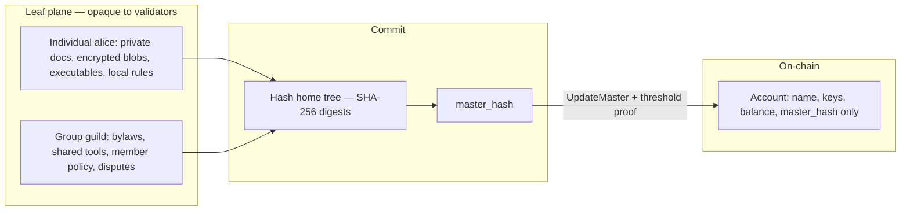
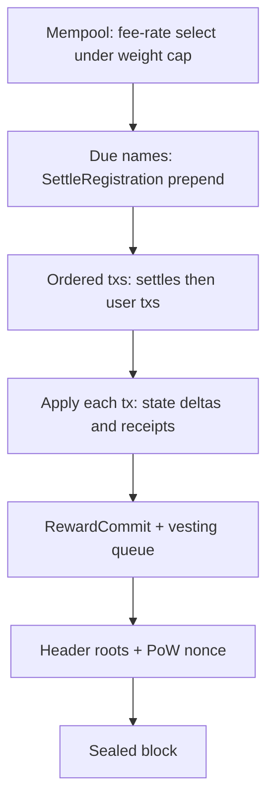

# Guld 2.0 Whitepaper

**Status:** current (mainnet SoT; Simba catches up via rule bundle)  
**Version:** 0.30  
**Date:** 2026-09-29  
**Token:** GULD (native)  
**Specifications:** [`../specs/README.md`](../specs/README.md) · **Glossary:** [§14](#14-glossary)

> **Normative detail:** This document explains **product intent**, economics, and security reasoning. **Implementations MUST follow** the numbered specs and accepted GIPs. Exact formulas, wire layouts, genesis pins, and field encodings live in specs — not here. Where this text and a spec disagree, resolve per the hierarchy in [`specs/README.md`](../specs/README.md).
>
> **Mainnet SoT:** Specs and this whitepaper describe **mainnet** protocol. **Simba** is a public testnet **snapshot** that trails Accepted Core GIPs until a **single height-activated rule bundle** lands ([055](../tasks/open/055-simba-single-rule-bundle.md)). Tip wipe is not an upgrade path.

---

## Abstract

**Address people by name.** Guld 2.0 is a **global, identity-focused layer-0**: a **PoW-anchored namespace and witness substrate** where people, groups, and unbounded dapps share one address space of **usernames**, **content hashes**, and **enumerated proofs**. Named accounts settle **transfers and grants** under a fixed tx vocabulary. The chain records that an account achieved consensus on a new **head** (master hash). It does not interpret why they signed, run their private scripts, or adjudicate their disputes.

The network is **not a general VM**: it validates fixed transaction schemas, checks hashes and signatures, and applies a small set of built-in state updates. Everything else lives in **leaves**. Cross-chain bridging and foreign-chain witnessing are **optional dapp designs**, not L0 v1 guarantees ([§3.4](#34-addressing-referencing-and-cross-chain-dapp-patterns)). Fees follow a **Bitcoin-style weight market** (GULD per virtual byte). Emission uses **double-SHA256 PoW** with Bitcoin-**parameter** timing — a **parameter class**, not a Bitcoin-class **security budget** claim ([§11](#11-security-notes-and-risks)).

Thesis and design goals: [§1.2](#12-thesis)–[§1.3](#13-design-bar). Clients reach nodes over **HTTP API** / **JSON-RPC** ([§2](#2-architecture-overview)); git and PGP remain **leaf** tools.

---

## 1. Motivation

### 1.1 The gap

Ethereum proved programmable settlement and fee markets. Bitcoin proved open Sybil-resistant consensus. Solana proved that non-conflicting account updates can proceed in parallel. None of them treat **human-meaningful identity** and **sovereign group process** as the primary object:

- Addresses are opaque key hashes, not names.
- “Multisig” and governance are applications, not the native tip model.
- Putting social process on a general VM forces every validator to re-execute politics—or forces that politics into custodial apps.

**Guld 1.0** was identity-first — registered names, ledger-cli accounting, git-backed leaves, and **identity- and contribution-weighted proof of stake** among stakers. Over time **consensus among stakers broke down** and **trust in the network diminished**. Operational complexity (git + PGP + weighted votes as the global bus; emails and UIDs as metadata; weak first-class cosign at L0) made it hard for new operators to run full nodes with confidence. Hard fork and 1.0 continuity: [`../FAQ.md`](../FAQ.md).

### 1.1a Why PoW for 2.0

2.0 keeps the identity-first product (names, groups, threshold tips, leaves) but moves **header consensus** to open **PoW** — the most stable, conservative, widely audited Sybil model. The goal is straightforward finality for new users and operators: scarce block space backed by work, not a stake quorum that had lost agreement. Account-level cosign authorizes tips and spends; it does **not** elect chain tips (§7.3).

### 1.2 Thesis

**Address people by name.** That is the product promise — manners as UX. The protocol expands it into a fixed triad:

**Address by name. Commit by hash. Authorize by proof. Pay a tx fee. Leave leaf law to the leaf — including dapps with no ceiling.**

(“Address by name” here is the first clause of the triad, not a competing slogan. Marketing SoT: [`../brand-concepts.md`](../brand-concepts.md).)

Guld 2.0 is an **L0 witness hub** for **registered identities**: settlement of fast paths and personal chains is “just another hash tip.” Cross-chain stories are **optional dapp designs** ([§3.4](#34-addressing-referencing-and-cross-chain-dapp-patterns)). Preserve historical 1.0 balances where possible; do not carry forward blockchain-in-git or FUSE as the 2.0 product model.

### 1.3 Design bar

| Goal | Meaning |
|------|---------|
| **L0 substrate** | Names + proofs + PoW anchoring under people and groups |
| Identity-first settlement | Transfers, grants, and permissions bind to **usernames / groups** (not a general DeFi VM) |
| Flexible leaves / dapps | **No app ceiling** — leaves run any stack; Guld only witnesses heads |
| Cross-chain (dapp layer) | **Theoretical** bridge/indexer/exchange patterns — not reserved L0 names ([`../specs/13-foreign-chains.md`](../specs/13-foreign-chains.md) informative) |
| Network as witness | Verifies **Guld** proofs and records heads — does not re-execute app or foreign VM logic |
| PoW **parameter** class | SHA256d, ≈10 min blocks, 2016-block / 14-day retarget ([spec 06](../specs/06-blocks-and-consensus.md)) — open membership and scarce space; **not** a peer-class hashrate / rewrite-cost claim ([§11](#11-security-notes-and-risks)) |
| Lean validators | No requirement to index social graphs or execute leaf interpreters |

### 1.4 Target user story

This is the product journey the reference stack optimizes for:

1. **Hear about Guld** — word of mouth, dapp, docs, or press.  
2. **Arrive** — open **guld.io** (bootstrap mirror) **or** install/run Guld software from source (`guld-node` + static wallet).  
3. **Create identity** — generate a key on-device, pick an **available name**, see the **estimated GULD registration fee** (`F_user(L)` + inclusion).  
4. **Get sponsored** — **guld.io** (or any paid registrar) takes off-chain payment, **or** someone they know sponsors on-chain (spec 16). Dual signatures; user keeps the private key.  
5. **Live in the PWA wallet** — installable on device; keys stay local (encrypted); user can **transact** (send to names) and **build their own dapp** under their home tip.  
6. **Link ecosystem tools** — especially a **browser extension** that holds/uses the same identity so the user can **log into websites** with their Guld name/key (challenge–response / signed auth — leaf/app convention, not a consensus opcode).  
7. **Browse the ecosystem** — visit many **Guld dapps** on many domains with **one key, one passphrase habit, one name** — no per-site hex wallets.

Steps 6–7 are **ecosystem UX** (extension and dapp conventions). They are not required for consensus validation; they are required for the intended everyday experience. Friend-only sponsorship and “build from git, never visit guld.io” remain fully valid.

### 1.5 Ecosystem comparison

Positioning sketch (not investment advice): Guld is an **L0 witness hub**, not a general VM L1. Full comparison table (vs Bitcoin, Ethereum, Solana, Cosmos Hub, …): [`../fragments/chain-comparison.md`](../fragments/chain-comparison.md) ([browse](/docs/?doc=fragments%2Fchain-comparison.md)). Hard fork / 1.0 continuity: [`../FAQ.md`](../FAQ.md). Security budget vs parameter class: [§11](#11-security-notes-and-risks).

### 1.6 Incumbent L1 pathologies (and Guld’s response)

Beyond the identity gap (§1.1), several **operational scaling patterns** on widely deployed L1s motivate a witness-first, fixed-tx design:

| Pathology | Bitcoin-like UTXO L1 | General VM L1 (EVM / SVM) | Guld 2.0 response |
|-----------|----------------------|----------------------------|-------------------|
| **Activity-driven state bloat** | Every payment can create new **UTXOs** (change, dust). Full nodes must retain the entire UTXO set (on the order of **10⁸ outputs**). **Dust** outputs often cost more to spend than they hold, yet linger in the set for years. | Account and contract **storage trie** grows with deployed apps; validators re-execute semantics on replay. | Consensus state grows with **registered names** (and subs), not with payment count. `Transfer` updates balances **in place** — no output fragmentation ([§9.1](#9-1-state-growth-keys-hashes)). |
| **Unbounded transaction shape** | Input/output count, witness bytes, inscriptions — txs can grow very large within block limits (e.g. consolidating hundreds of dust UTXOs). | Calldata, nested calls, logs — high variance under a gas cap. | **Fixed tx vocabulary** ([§6](#6-transaction-types-network-surface)); optional **64-byte** memo; bulk data and app logic in **leaves** ([§4](#4-leaves-witnessing-and-cowitnessing)). Worst-case L0 size scales **linearly** with cosigner count and is **weight-priced**. |
| **Process and content on L0** | Money-first; identity and governance are app-layer. | Multisig, DAO votes, and social rules are contracts every validator re-runs. | Threshold cosign and name→keys are **native**; leaf politics stay off L0. Tips are **hashes**; CAS bytes are optional per operator ([§9.4](#9-4-data-availability)). |

**UTXO clutter** is the canonical UTXO-L1 example: state tracks **outputs**, so high payment volume and dust accumulation burden every full node even when most outputs are economically worthless. Guld’s account model avoids that fragmentation — value lives in a **balance per name**; a payment does not mint permanent new consensus rows. Namespace spam is gated by **registration protocol fees** (`F_user`, `F_group`, `F_sub` — §8.7) rather than free output creation inside unrelated transactions.

This does **not** claim higher **L1 throughput** than Bitcoin (same block-weight class and ~10-minute target — [spec 07](../specs/07-fees-and-tokenomics.md)). The win is **cleaner state hygiene** and **more useful work per on-chain byte** when applications batch activity in leaves (one `UpdateMaster` tip vs many L0 payments or contract calls).

---

## 2. Architecture overview

```
┌─────────────────────────────────────────────────────────────┐
│  Consensus plane                                            │
│  SHA256d PoW headers · fork choice · coinbase · fees        │
└────────────────────────────┬────────────────────────────────┘
                             │ commits to state_root
                             ▼
┌─────────────────────────────────────────────────────────────┐
│  State plane (KV + sparse Merkle / authenticated tree)      │
│  username → account · keys · threshold · master_hash        │
│  balances · nonces · receipts                               │
└────────────────────────────┬────────────────────────────────┘
                             │ references content hashes
                             ▼
┌─────────────────────────────────────────────────────────────┐
│  Object plane (CAS + optional git remotes)                   │
│  personal / group trees · forge clones · encrypted blobs    │
│  local/optional retention · leaf hosts materialize clients  │
└─────────────────────────────────────────────────────────────┘
                             │
                             ▼
┌─────────────────────────────────────────────────────────────┐
│  Clients (unknown) + optional indexers                      │
│  Browser / game / CLI ↔ node (HTTP · JSON-RPC) · leaf · index│
└─────────────────────────────────────────────────────────────┘
```

**Stack:** Rust validator; polyglot leaf tooling (including Python/JS meta-FS packages as leaf hosts). Users may push leaf git to GitHub or any forge for free distribution. SHA-256 for commitments; **AES-256 only in the reference wallet** (key encryption at rest — not leaf/CAS content); account signatures Ed25519 at genesis with a documented PQ migration path (hybrid / ML-DSA). Leaf bytes are opaque; owners may encrypt locally with any tool.

**Node surfaces:** **P2P** is the primary mesh among full nodes (blocks, txs, CAS). Wallets and dapps talk to a node only via its client APIs: canonical **HTTP** (`/api/v1/…`) and **JSON-RPC** (or a reverse proxy in front of those)—typically the user’s own node. Nodes do **not** expose IPC or embed app logic; libraries such as **`guld-client`** are client-side helpers that still speak HTTP/RPC to a node. **Dapp-to-dapp** coordination is separate: leaves MAY use any transport between themselves (HTTPS between domains, IPC, in-process calls, …)—e.g. a Guld lightning group calling a guldex group over HTTP to settle instantly—then each posts proof-bearing txs to a node when L0 settlement is needed. The reference static wallet is the **guld git tree itself** (served via `--http-static` or any static host) and may be mirrored on a domain such as guld.io — that domain is a **bootstrap URL**, not a consensus hub.

---

## 3. Identity model

### 3.1 Names and hashes

| Concept | Role |
|---------|------|
| **Username / group name** | Human-addressable primary handle on the network |
| **Account id** | Stable internal id (hash of registration commitment) |
| **Master hash** | Single SHA-256 committing to the account’s defined tree + meta |
| **Content hashes** | SHA-256 (or tree roots) referencing CAS objects |

People say: *pay `alice`*, *send to `guild/traders`*, *follow tip of `bob`*. Machines settle against the registered mapping and the current master hash.

### 3.2 Account structure and network-level home

```
name
├── keys[]              # verification keys
├── threshold           # cosign policy for tip / spend / recover
├── nonce
├── master_hash         # SHA-256 head of the account home
└── balance (GULD)
```

```
master_hash = SHA256(
  home_tree_root ‖          # SHA-256 Merkle (or equivalent) of defined home objects
  account_meta_root ‖
  … schema-frozen fields …
)
```

**Primary homes are hash trees at the network layer**, not git objects. The chain stores the **identity record** (name, keys, threshold, `master_hash`, balances). Home **bytes** live in CAS; tip ≠ DA ([§8.8](#88-content-retention-leaf-not-l0)), including account **`guld`** ([§3.5](#35-reserved-name-guld-network-identity)).

**Leaf formats under the home** (git repos, game data, HTTP app trees, encrypted blobs, …) are optional and opaque. Git is a fine leaf encoding for free forge hosting; it is **not** the network home format. Other leaf formats—including as the bulk of a personal or group home—are first-class as long as the committed root is SHA-256.

Validators never open leaf formats; they only check that proofs authorize a new `master_hash`.

### 3.3 Registration (priced; anti-spam)

Registering a name consumes **global namespace** and creates durable validator state. It must be **painful to spam**, continuing the Guld 1.0 idea of explicit registration fees for individuals and groups.

| Kind | Who pays | Fee (consensus) |
|------|----------|-----------------|
| **Individual** | Payer account | **`F_user(L)`/year** — letter-based; 1-letter names premium, ≥6 letters = **1 GULD** floor **plus** inclusion fee |
| **Group** | Payer account | **`F_group(L, n) = F_user(L) × (2 + n)` GULD**/year (`L` = letters in root name; `n` = initial signer count) **plus** inclusion fee |
| **Subaccount** | Parent individual | **`F_sub = 0.1 GULD`/year** fixed **plus** inclusion fee — `parent.label` device / hot-cold wallets |

**Why scale group fees with signer count:** each additional key enlarges proofs the network must verify for the life of that account (registration now; every threshold tip later). Charging upfront for `n` aligns payment with **proof complexity** the validators will perform.

Fee formulas (`F_user`, `F_group`, `F_sub`), letter pricing, and the **8-block miner vest**: [§8.7](#87-registration-fees-miner-lottery) and [spec 07](../specs/07-fees-and-tokenomics.md). Fees buy **DNS-style pay-or-release** control ([GIP-11](../gips/gip-11.md)); legacy-locked imports follow the same lease clock ([GIP-27](../gips/gip-27.md)).

**Bootstrap (no name yet):** registration requires a **sponsor** with GULD. The future name holder signs a **registration intent** (`guld/register/intent/v1`); the sponsor signs the spend (`guld/register/v1`). Both signatures are required on-chain — see [`../specs/16-sponsored-registration.md`](../specs/16-sponsored-registration.md). Friend-sponsor or optional paid desk: [§4.6](#46-optional-paid-registrar-any-peer) / [GIP-8](../gips/gip-8.md).

Legacy 1.0 balances import as **claimable pre-mine accounts**; spend unlocks after `ClaimLegacy` ([§8.6](#86-supply-pre-mine-and-issuance), [spec 15](../specs/15-ledger-import.md)).

### 3.4 Addressing, referencing, and cross-chain dapp patterns

- **Address people by name** in UX and high-level txs (`Transfer { to: "alice", amount }`).
- **Reference by hash** for tips, trees, and proofs (`master_hash`, CAS oids).
- Resolvers and indexers may cache name→id; consensus stores the authoritative map.

**No reserved foreign names (A11).** Guld **does not** genesis-reserve `bitcoin`, `ethereum`, `solana`, or similar labels. Only **`guld`** is a network account. If a bridge team wants a short public name, they **register it** (letter fees, first-come) and operate under ordinary cosign rules.

**Cross-chain is a theoretical dapp capability, not L0 v1 consensus.** Leaves MAY build indexers, bridges, exchange desks (**guldex**-style), lightning-style channels, or personal chains that commit hashes under registered names. L0 stores only **Guld**-authorized tips and ordinary txs — no exchange opcode and no foreign light-client verify in v1. Informative sketches: [`../specs/13-foreign-chains.md`](../specs/13-foreign-chains.md). Future enumerated foreign proof kinds require a GIP and height activation.

| Pattern | What a dapp **could** do | What L0 v1 **does** |
|---------|--------------------------|---------------------|
| **Foreign indexer / bridge** | Register e.g. `acme-bridge`; run BTC/ETH/SOL infra off-chain; publish checkpoints in leaf CAS; cosign `UpdateMaster` | Stores only **Guld**-authorized tips for that registered name |
| **Exchange / channels / app chain** | Leaf ledger or off-hub state; settle via `Transfer` or periodic tip commit | Witnesses cosigned head / ordinary txs only |
| **Token peg** | Lock/mint, watchers, fraud proofs — separate product | Not implied by the namespace |

The main Guld chain stays a **scarce, weight-priced settlement and naming plane**. Speed, foreign consensus verification, and cross-chain liquidity live in **leaves**.
### 3.5 Reserved name: `guld` (network identity)

The username / account **`guld`** is **reserved for the network itself**. It is not available for public registration.

Its on-chain home tip commits to a compact **rule bundle**—schemas, genesis params, weight tables, proof-kind definitions—that honest nodes enforce. That is the network’s normative **parameter set**, not a mirror of developer source repositories.

**Node software** (full node, wallet, leaf SDKs) ships from **ordinary git repos** maintained by operators (e.g. `https://guld.io/repos/guld.git`). Full nodes **do not** need to clone or materialize protocol **source code** from the `guld` CAS tree to validate blocks. Block headers carry **`guld_rules_hash`** (digest of the rule bundle **active at that height**); the node must know that digest and apply the matching logic ([`../specs/17-protocol-upgrades.md`](../specs/17-protocol-upgrades.md)).

```
on-chain account "guld"
  └── master_hash  →  rule params, schemas, fee tables (small normative bundle)
        └── NOT required: full node / wallet / website source trees
```

Consensus cares about the committed rule digest and registered keys under `guld`, not where engineers keep their checkouts.

**Implications**

| Topic | Rule |
|-------|------|
| Namespace | `guld` cannot be registered by users; genesis-created |
| Rules | Headers include `guld_rules_hash`; must match the rule bundle **active at that height** |
| Source code | Off-chain git — **not** consensus data availability |
| Upgrades | Height-activated: publish next bundle with `activation_height = H`; headers switch digest at H; ship matching node binary first ([`../specs/17-protocol-upgrades.md`](../specs/17-protocol-upgrades.md)) |
| Light clients | Trust headers / proofs; need not fetch `guld` home bytes |

---

## 4. Leaves, witnessing, and cowitnessing

### 4.1 Leaf sovereignty

A **leaf** is a personal home or group realm: its members may use any languages, scripts, and local rules. Disputes (“why we signed”) are resolved **inside** the leaf.



Individuals and groups may keep **private files**—including encrypted blobs and **executables**—under whatever leaf policy they choose (bylaws, scripts, runtimes). The network does not open those bytes. What enters consensus is only a **content-addressed tip**: hash the home tree → `master_hash`, then authorize `UpdateMaster` with an enumerated proof (usually threshold cosign). Any leaf format is valid so long as the committed head is a SHA-256 (or equivalent) hash.

The network accepts a tip update only if it carries an **enumerated, externally verifiable** leaf-consensus proof under the account’s current on-chain policy—for genesis, primarily:

**`threshold_cosign_v1`:** at least `threshold` signatures over

```
SHA256( account_id ‖ prev_master_hash ‖ new_master_hash ‖ nonce ‖ chain_id )
```

`nonce` is the account’s on-chain sequence number (starts at 0). It binds each tip advance to exactly one successor step: if two leaf processes race from the same head, only the first included `UpdateMaster` succeeds; the other’s cosignatures become stale and must be reissued after re-reading `(master_hash, nonce)` from a node. The same nonce also serializes spends and other account mutations — no merge at L0, only explicit ordering.

Additional proof kinds require explicit protocol upgrades.

### 4.1b Dapps: you can literally do anything

On most L1s, a “dapp” is trapped inside a **shared VM**: gas meters, opcode sets, and every validator re-executing your logic. That caps ambition—and taxes the whole network for your creativity.

**Guld inverts that.** A dapp is a **leaf** (or a composition of leaves) under one or more names. The chain only asks: *did the right keys authorize this new head, and was the fee paid?* It does **not** ask what the bytes mean. So a Guld dapp MAY be a static site or full web app on a custom domain, a native game or desktop binary, an agent or long-running service, encrypted vaults, guild tooling, markets, DAOs-as-process — **whatever the builders ship**. Cross-dapp and cross-chain flows (§3.4) are leaf designs; settlement that must hit L0 uses ordinary proof-bearing txs.

There is **no on-chain language whitelist**, **no gas ISA for app logic**, and **no requirement** that every validator understand your stack. Unsupported leaf types are still valid on-chain; clients that care materialize them; others ignore them.

**Expectation:** the protocol’s job is identity, money, and witnessed tips. The dapp’s job is the rest. If it can run on a computer and commit a hash under your keys, it can be a Guld dapp. One common shape: users run (or trust) a node; the reference wallet is static files; dapps live on **their** domains; settlement stays on the **P2P mesh**.

### 4.2 Witness and cowitness responsibility

| Actor | Responsibility |
|-------|----------------|
| **Account / key holder** | Whatever they sign: they **witness** that `new_master_hash` is the authorized head |
| **Cosigners** | Jointly **cowitness** the same statement; threshold failure ⇒ tip rejected |
| **Validators / miners** | Witness that the proof verifies and the fee is paid; they do **not** endorse leaf politics |
| **Leaf hosts / remotes** | Hold bytes clients need; availability is **off** the consensus path (leaf contracts, self-host, forges) |

Signing is **attributable**. Social or legal meaning of a cowitness remains a leaf concern; cryptographically, cowitnesses are jointly necessary for the tip to enter global history.

### 4.3 What the node does *not* do

- Run leaf interpreters as a consensus requirement (Python, WASM guild scripts, games, …)
- Read emails, PGP UIDs, or git commit headers as consensus input
- Decide internal group disputes
- Require a global metadata index to produce blocks

### 4.4 Clients, leaf hosts, and free git remotes (UX)

The **ultimate client is undefined**: a browser UI, a native game binary, a CLI, a mobile app, an agent. **Guld only knows names and heads.** To *use* files and code, a client must talk to something that holds **leaf material**—not merely the on-chain `master_hash`.

```
  unknown client (browser / game / CLI / …)
           │
           ▼
  leaf host  ←── full node software can provide this as a local/remote service
  (clone, serve files, run optional leaf runtime)
           │  push / fetch git or CAS
           ▼
  leaf remotes (often free): GitHub, Forgejo, self-host, …
           │  announce new tip
           ▼
  network validators  (verify proof + fee; store master_hash only)
```

**Git as empowerment, not consensus bus.** Individuals or groups can use free git hosting for home or group trees; clients push/fetch to distribute updates and recompute hashes that become the next `master_hash`. Consensus does **not** require forge uptime or git metadata—only a valid proof over the new head. Optional `remotes[]` hints are convenience, not consensus truth.

**Runtime is leaf-defined.** A leaf might expose HTTP + browser UI, load a game binary, run notebooks, or stay static — or invent something new. Full node software **may** start services for supported leaf types; it need not understand every leaf (§4.1b).

**“Connected to a node that supports their leaves.”** Wallet-only clients can transfer GULD and read heads from any reachable full node (**HTTP API** / **JSON-RPC**). Contentful clients need a **leaf host** that tracks tip, materializes the tree, and optionally runs the leaf runtime. Relying solely on a commercial forge is a **UX bootstrap**, not protocol DA (§9.4).

### 4.5 Reference UI and guld.io

Reference clients ([`../specs/14-reference-ui.md`](../specs/14-reference-ui.md); GIP [`../gips/gip-5.md`](../gips/gip-5.md)):

| Surface | Role |
|---------|------|
| **Static webapp / PWA** (repo root) | **Primary** reference wallet — register, send, balance, activity, explorer, docs; installable cross-platform |
| **`guld-wallet` (desktop)** | Optional — file keyring, legacy PGP claim, external signing for users who keep keys off the browser |

**How it runs:** the wallet is **open-source static files in this repository** (no Node.js build). Each user SHOULD run it against **their own** `guld-node --http` (optionally `--http-static .`). The **guld.io** domain is a convenient **bootstrap URL** and one mirror of that software — not the only place wallets may live, and not a required peer for consensus.

**API:** the reference PWA uses the node **HTTP API** (`/api/v1/…`); desktop and server clients MAY use **JSON-RPC** (or libraries such as **`guld-client`** that speak those APIs). Nodes do not offer IPC. Writes are proof-bearing (signed txs); the node MUST NOT store user keys.

**Target journey:** §1.4 — hear about Guld → wallet → name + fee → sponsor → installable PWA → extension login → many dapps, one identity. Rust **`guld-client`** backs the desktop signer; the PWA uses JS/WASM signing aligned to the same message formats. A **browser extension** is the preferred bridge for “log into this website as `alice`”; it is ecosystem software (not consensus), but it is part of the **target** everyday path alongside the PWA.

### 4.6 Optional paid registrar (any peer)

The bottleneck for a newcomer is finding someone with GULD to sponsor a name. **Any funded account** MAY enable a **paid registrar** in the reference software: connect a **supported third-party payment gateway**, publish a pay link, and on webhook fulfillment submit the portable registration request as payer — identical to friend-sponsor on-chain ([GIP-8](../gips/gip-8.md)). guld.io / **isysd** may run this first during bootstrap; that does not reserve the role. Friend-sponsor without payment remains fully supported. Payment rails are **out of protocol** and MUST NOT be required by `guld-node` validation.

---

## 5. Network validation (not a VM)

The Guld chain is intentionally **not** a programmable machine for app logic. It may:

- validate fixed **schemas** for a closed set of tx types  
- check **hashes**, **signatures**, and enumerated **leaf-consensus proofs** (`threshold_cosign_v1` in v1; foreign proof kinds only after a future upgrade)  
- apply **built-in** balance/tip/key updates  

It does **not** host user-defined functions, loops, or leaf languages. Those run only in leaves — which is exactly why dapps are unbounded (§4.1b) and why fast paths settle as **tips** (§3.4). That is why Bitcoin-style tx fees fit and an EVM gas ISA does not.

---

## 6. Transaction types (network surface)

Guld has a **closed vocabulary** — no user-defined opcodes. At a high level:

| Category | Examples |
|----------|----------|
| **Names** | Register individual / group / sub; yearly settle (pay-or-release); rotate keys; **convert account kind** ([GIP-28](../gips/gip-28.md)) |
| **Money & tips** | Transfer GULD (1-of-1 or threshold cosignatures); update `master_hash` with a leaf-consensus proof |
| **1.0 continuity** | Claim legacy import (key upgrade) |
| **Miner rewards** | `RewardCommit` + mature `ClaimReward` ([GIP-22](../gips/gip-22.md)) |

Fee-paying txs MAY carry an optional opaque **`memo`** (weight-priced). Every tx pays a **weight-based inclusion fee** to miners. Non-overlapping **conflict sets** may apply in parallel within a block.

**Normative schemas, auth rules, and weights:** [`../specs/03-transactions.md`](../specs/03-transactions.md).

---

## 7. Consensus

### 7.1 Role of PoW

Open membership for block proposal uses **Bitcoin-style double-SHA256 PoW** on headers that commit to chain state, txs, active rule bundle, and miner identity. Useful validation (schema + proof verify + state transition) is **eligibility**; PoW elects among valid candidates and prices Sybil spam.

**Target:** ~**10 minutes** per block, **2016-block** difficulty retarget, **median-time-past** + bounded future skew on timestamps ([spec 06](../specs/06-blocks-and-consensus.md) §2–§3). **DAG-PoW** and **merged mining** remain optional future upgrades — **not** required for mainnet launch (solo SHA256d is enough; merge-mine is a later miner bonus if ever pursued).



Miners order txs under the weight cap, prepend due name settles, apply state, schedule registration-fee vesting, commit rewards ([GIP-22](../gips/gip-22.md)), seal a PoW header. Peers re-apply the same txs — they never execute leaf code inside the block. **Header layout, fork choice, and miner path:** [`../specs/06-blocks-and-consensus.md`](../specs/06-blocks-and-consensus.md), [`../specs/10-node.md`](../specs/10-node.md).

### 7.2 Finality

Probabilistic depth (Nakamoto / GHOSTDAG-class). Optional later checkpoints are a separate discussion.

### 7.3 Relation to stake

Tip election is **not** PoS. Account **cosign** (threshold keys on tips and spends) is authorization for that name’s state — not a replacement for header PoW.

---

## 8. Tokenomics and fees

Fees match the fixed-tx design in [§5](#5-network-validation-not-a-vm): weight-priced inclusion, not an EVM gas ISA.

### 8.1 Native asset: GULD

| Use | Description |
|-----|-------------|
| **Transaction fees** | Weight-priced inclusion fees → **miners** |
| **Registration fees** | `F_user(L)` / `F_group(L, n)` / `F_sub` → **block miner** (§8.7; anti-spam lottery) |
| **Transfers / named settlement** | Settlements between named identities |
| **Miner rewards** | Block subsidy (PoW issuance) + inclusion fees + registration fees |

Hard fork from 1.0: import every positive `*:Assets` balance from `archives/ledger-guld` as genesis pre-mine **x**, then unlock per name via **key upgrade** (spec: [`../specs/15-ledger-import.md`](../specs/15-ledger-import.md); GIP: [`../gips/gip-14.md`](../gips/gip-14.md)). See §8.6.

### 8.2 Why not an EVM-style gas ISA

| EVM gas | Guld network |
|---------|----------------|
| Meters arbitrary script steps | No custom functions at L0 |
| `gas_limit` / opcode schedule | Fixed tx kinds; cost ≈ size + sigs |
| Complex refunds / metering bugs | Simple weight policy |

Leaf runtimes may invent their own internal metering; Guld never sees it.

### 8.3 Weight (virtual size)

Each tx has a **weight** in virtual bytes (vB), Bitcoin-style: serialized size plus surcharges for signatures verified and extra account writes. Large group cosign sets stay expensive **every tip**, not only at registration.

Registration also charges a separate **protocol fee** in GULD (`F_user(L)`, `F_group(L, n)`, or `F_sub`) — see §3.3 and §8.7.

**Normative formula, constants, and example weights:** [`../specs/07-fees-and-tokenomics.md`](../specs/07-fees-and-tokenomics.md) §1.

### 8.4 Fee market (Bitcoin-style)

Users bid **`inclusion_fee`** (GULD per vB, mempool-ordered). **Registration protocol fees** vest to miners over **8 blocks** ([GIP-10](../gips/gip-10.md)) so a miner cannot self-deal the full `F_*` in one win. Blocks cap total weight (Bitcoin-order magnitude). Congestion ⇒ higher fee rates — no EVM opcode schedule.

**Relay floors, block limit, and GIP-22 payout path:** [`../specs/07-fees-and-tokenomics.md`](../specs/07-fees-and-tokenomics.md) §2–§4, [GIP-22](../gips/gip-22.md).

### 8.5 Block capacity (order of magnitude)

If average tip update ≈ 300 vB and block weight limit = 4 M:

| Effective blocks/sec | Tip updates/sec (order) |
|----------------------|-------------------------|
| 0.1 | ~1 300 |
| 1 | ~13 000 |
| (DAG parallel blocks) | higher; specify in client |

Sig-heavy tips consume more weight → self-limit. Target remains **scarce PoW block space** (Bitcoin-**parameter** interval and weight caps), not Visa-class payment rails.

### 8.6 Supply, pre-mine, and issuance

#### Pre-existing GULD as genesis pre-mine

Guld 2.0 is a **hard fork** that respects 1.0 balances: every positive member `name:Assets` from the `ledger-guld` snapshot is imported **1:1** at genesis as disclosed pre-mine **x** (~**960k GULD**, **≈ 2,217** holders). ERC20 / protocol mirror buckets are **omitted**. Amounts use **10** decimal places. Genesis embeds a verifiable **import manifest hash** ([GIP-14](../gips/gip-14.md), [`../specs/15-ledger-import.md`](../specs/15-ledger-import.md) §2.1) — network-specific pins live in genesis artifacts, not in this document. **Distribution disclosure** (concentration, Equity / package-manager grants, fee negatives, unlock-path split, `x` reconciliation): [`../fragments/legacy-distribution.md`](../fragments/legacy-distribution.md) ([GIP-24](../gips/gip-24.md) Accepted Informational). Continuity is **1:1 historical balances**, not peer-fair initial allocation.

#### Respect balances; unlock via key upgrade

**Invariant:** no haircut, no silent consolidation, no reassignment of names.

Import creates **legacy-locked** accounts: balance is on-chain, but spend and tip authority require **`ClaimLegacy`** (PGP proof when bound; **`isysd` attestation** when unbound). Name control follows the same **pay-or-release** settle clock as other accounts ([GIP-27](../gips/gip-27.md)) — unfunded overdue imports release; funded ones renew while remaining legacy-locked until claimed. **New** GULD after genesis enters only via **PoW subsidy** ([GIP-22](../gips/gip-22.md) commit/claim path).

#### Block time and inflation **shape**

**~10 minute** blocks, Bitcoin-**parameter** retarget (2016 blocks / 14-day window, 4× clamp — [spec 06](../specs/06-blocks-and-consensus.md); schedule enforced on import — [GIP-23](../gips/gip-23.md)). Annual inflation **i(y)** decays by **two-thirds each year**, floored at **4%** from year 9 — year 1 opens at **100%** (strong bootstrap), then cools. Subsidy steps every **2016 blocks** (aligned with retarget). Starting supply **S(0) = x**.

**Why (2/3) decay:** slower paths stay too hot for a decade; this reaches a **4%** issuance tail without a cliff. That is an **issuance** design toward a long-run miner budget — not a promise that early hashrate matches large PoW networks.

**Exact formulas, epoch math, and per-block tables:** [`../specs/07-fees-and-tokenomics.md`](../specs/07-fees-and-tokenomics.md) §5–§6.

##### Supply and inflation (illustrative)

```mermaid
xychart-beta
    title Inflation rate i(y) — (2/3)^(y-1) floored at 4%
    x-axis [1, 2, 3, 4, 5, 6, 7, 8, 9, 10, 11, 12, 13, 14, 15, 16, 17, 18, 19, 20]
    y-axis "i(y) %" 0 --> 100
    line [100, 66.7, 44.4, 29.6, 19.8, 13.2, 8.8, 5.9, 4.0, 4.0, 4.0, 4.0, 4.0, 4.0, 4.0, 4.0, 4.0, 4.0, 4.0, 4.0]
```

```mermaid
xychart-beta
    title Circulating supply / x (gross subsidy; burns omitted)
    x-axis [1, 2, 3, 4, 5, 6, 7, 8, 9, 10, 11, 12, 13, 14, 15, 16, 17, 18, 19, 20]
    y-axis "S/x" 0 --> 20
    line [2.0, 3.3, 4.8, 6.2, 7.5, 8.5, 9.2, 9.7, 10.1, 10.5, 11.0, 11.4, 11.8, 12.3, 12.8, 13.3, 13.9, 14.4, 15.0, 15.6]
```

```mermaid
xychart-beta
    title Block subsidy (GULD per 10-minute block)
    x-axis [1, 2, 3, 4, 5, 6, 7, 8, 9, 10, 11, 12, 13, 14, 15, 16, 17, 18, 19, 20]
    y-axis "GULD/block" 0 --> 30
    line [18.3, 24.4, 27.1, 26.1, 22.5, 18.0, 13.6, 9.8, 7.1, 7.4, 7.7, 8.0, 8.3, 8.7, 9.0, 9.4, 9.7, 10.1, 10.5, 11.0]
```

Miner revenue uses **`RewardCommit`** (block `txs[0]`) plus mature **`ClaimReward`** ([GIP-22](../gips/gip-22.md)): subsidy, inclusion fees, and vested registration shares are **committed** at height `h` and **mint** when the claim is included at **`h + 100`**. Claims MAY wait in mempool during the maturity window.

#### Why not zero long-run inflation?

New humans and new named identities continually join. Registration fees fund miners alongside issuance; perpetual **4%** tail funds security and leaves room for newcomers.

| Flow | Direction | Rationale |
|------|-----------|-----------|
| 1.0 `*:Assets` → genesis | Pre-mine **x** (locked until key upgrade) | Continuity; respect every balance |
| Key upgrade (`ClaimLegacy`) | Unlock spend/tip under new keys | Port 1.0 → 2.0 without moving coins |
| Block subsidy | Commit at `h`, mint via `ClaimReward` ~`h+100` | PoW issuance + distribution ([GIP-22](../gips/gip-22.md)) |
| Inclusion (weight) fee | User → miner (via commit/claim path) | Pay for block space |
| Registration `F_*` | User → **miners (8-block vest → commit/claim)** | Anti-spam + lottery without same-block self-deal |

**Invariant:** no hidden inflation beyond the issuance schedule; **x** and the per-name import manifest are disclosed at genesis; registration fees are consensus-enforced and paid to miners over eight blocks; no imported balance spends until key upgrade.

### 8.7 Registration fees (miner lottery)

Registration charges a **protocol fee** separate from weight-priced **inclusion**. Fees buy **one year** of name control ([GIP-11](../gips/gip-11.md)); at expiry miners run permissionless **pay-or-release** settle.

**Letter-based pricing ([GIP-9](../gips/gip-9.md) Final):** short root names are premium; names with **≥ 6 letters** hit a **1 GULD**/year floor. Groups scale as **`F_user(L) × (2 + n)`** — more signers ⇒ more proof work forever. Subaccounts stay **0.1 GULD**/year under a parent.

The full `F_*` debits at apply, then **vests to miners over 8 blocks** ([GIP-10](../gips/gip-10.md)) — no burn. A miner who self-registers recovers only ~1/8 per block. Transfers and tip updates pay inclusion only.

**Fee table, letter count rules, vesting split, and RPC estimates:** [`../specs/07-fees-and-tokenomics.md`](../specs/07-fees-and-tokenomics.md) §3.

#### Game theory

| Threat | Mechanism |
|--------|-----------|
| Squat millions of names | Letter-based **`F_user(L)`** + scaled **`F_group(L, n)`**; live-cap on subaccounts |
| Device-wallet spam | **0.1 GULD** per sub + max **8** live |
| Miners ignore registrations | Vesting still pays includers first share + subsequent winners; inclusion fee is immediate |
| Miner self-registers / self-settles | Full `F_*` only if they win **8 consecutive** blocks |
| Groups cheap vs proof cost | `F_group(L, n) = F_user(L) × (2 + n)` |

### 8.8 Content retention (leaf, not L0)

**Locked:** there is **no** network-level pin / data-availability market in consensus. **Tip ≠ data availability** — the chain stores `master_hash` only; bytes live in CAS / remotes / leaf hosts when someone chooses to fetch them. Protocol **source code** is not an L0 retention obligation. Who keeps bytes: self-host, forge mirrors, BitTorrent-class sharing, or **private leaf contracts**. Enforcing blob availability on-chain needs a hard DA protocol; that is **out of scope for L0** in this design. Optional storage markets MAY appear only as **apps/leaves**. Detail and light-client notes: [§9.4](#94-data-availability-not-an-l0-product).

---
## 9. Scalability analysis

### 9.1 State growth (keys + hashes)

On UTXO L1s, consensus state often scales with **transaction outputs**: each payment may add change and dust UTXOs that full nodes must index until spent. On general VM L1s, state scales with **accounts plus contract storage**. Guld separates these concerns: **payments do not expand the namespace**; only registration (and subaccount creation under a parent) adds rows. A `Transfer` touches existing accounts; value is a scalar balance, not a growing set of coin objects (contrast §1.6).

Validators store per account roughly: 1 key (32 B) + ~10 SHA-256 fields (320 B) + meta, with LSM/SMT overhead (~2.5–4×).

| Accounts | Cold state (≈ mid overhead) |
|----------|-----------------------------|
| 10 M | ~10 GiB |
| 100 M | ~100 GiB |
| 1 B | ~1 TiB |

Retaining **10 historical tips for recently active** accounts only adds marginally. This is realistic for global identity **because file bytes are not in the consensus DB**.

### 9.2 Bandwidth and CPU

- Bottleneck: **signature verification** ∝ signatures per tip, not SHA-256.  
- 1 000 single-sig tip updates/s ≈ order **0.1** core-s/s at ~100 µs/verify (parallelizable).  
- Large thresholds (e.g. 100-of-150) raise **weight and CPU** linearly—**priced in**, self-limiting.

### 9.3 Execution parallelism

Conflict graph = accounts touched. Alice’s `UpdateMaster` ∥ Bob’s `UpdateMaster`. Contended names/accounts serialize. This matches Solana-style account parallelism without adopting the SVM.

### 9.4 Data availability (not an L0 product)

See [§8.8](#88-content-retention-leaf-not-l0): tip finality ≠ content permanence. Tips scale with accounts; blobs scale with **leaf hosting and mirrors**. Full nodes validate against headers and state; they are **not** required to store ordinary account home bytes. Light clients verify state proofs against headers. Validators MUST know the **active rule-bundle digest** (`guld_rules_hash`) — a small normative parameter set ([spec 08](../specs/08-cas-and-homes.md) §4 / [spec 17](../specs/17-protocol-upgrades.md)), not a general DA obligation.

### 9.5 Comparison

| Approach | Validator state | Per-tx work |
|----------|-----------------|-------------|
| General L1 VM re-executing group logic | Large + unbounded | High, variable |
| Guld L0 witness (fixed txs) | Keys + tips + balances | Schema + proof verify + writes |
| Git mega-repo consensus | Explodes with history | Merge/social metadata |

**Conclusion:** identity-scale state is feasible; throughput is gated by **block weight**, **proof size**, and **PoW/DAG rate**—the same *kinds* of levers Bitcoin uses (weight cap, proof size, block interval)—not by leaf language choice. That is an engineering analogy, not a peer-class security claim.

---

## 10. Game theory analysis

### 10.1 Players

| Player | Action | Payoff drivers |
|--------|--------|----------------|
| Users / groups | Register, tip, transfer, cosign | Utility of settlement + reputation of name |
| Cosigners | Sign or withhold | Shared control vs liability of cowitness |
| Miners | Which valid txs to include; PoW | Rewards − energy − orphan risk |
| Leaf hosts | Retain or drop bytes | Leaf contracts / reputation / fees (off L0) |
| Attackers | Spam, squat, forge, reorg | Theft / griefing vs cost |

### 10.2 Leaf cosign as a game

- **Threshold policy** is on-chain; internal preference aggregation is off-chain.  
- Rational cosigners sign when the leaf process they accept says so; the chain cannot force “honest politics,” only **attributable authorization**.  
- **Griefing:** a minority below threshold cannot advance the tip; a malicious majority *of keys* can—same as any multisig. Mitigations: key rotation, role separation (tip vs spend), social recovery schemes as leaf policy compiling to `RotateKeys`.  
- **Cowitness liability:** cryptographic responsibility is clear; expanding legal meaning is out of protocol scope but supported by auditable signed messages.

### 10.3 Fee market

- Under congestion, users raise **inclusion fee rate** (GULD/vB); low-fee tips wait.  
- Miners maximize **inclusion + registration protocol** fees under the weight limit (Bitcoin-like).  
- **Registration lottery** (§8.7): `F_*` vests over 8 blocks — incentivizes inclusion of the first share without letting a single-block self-deal recover the full fee.  
- High early **subsidy** (year 1 doubles supply; then rapid cool-down) aims to attract hashpower and dilute pure pre-mine dominance over time; long-run **4%** is an **issuance** floor toward a sustained miner budget — realized security still depends on actual hashrate and markets ([§11](#11-security-notes-and-risks)).

### 10.4 PoW security

- **Parameter class:** SHA256d, ≈10 min spacing, 2016-block retarget with 4× clamp ([spec 06](../specs/06-blocks-and-consensus.md)); claimed difficulty MUST match schedule on import ([GIP-23](../gips/gip-23.md)).  
- **Security budget ≠ parameter class.** Cost of a deep rewrite scales with energy × depth **at the hashrate that actually exists**. Early Simba / mainnet bootstraps MUST NOT be described as Bitcoin-class rewrite resistance.  
- DAG-PoW (research) would change throughput and topology, not the “work is scarce” principle.  
- **Nothing-at-stake** is primarily a PoS issue; pure PoW proposers still risk orphaned work (wasted energy).

### 10.5 Username scarcity and registration cost

Free names ⇒ squatters. **`F_*` fees and pay-or-release** ([§8.7](#87-registration-fees-miner-lottery)) make bulk registration painful; `F_group` scales with signer count to price proof burden. No resale market. Impersonation remains social; cryptographic binding is name→keys on-chain.

### 10.6 Validator laziness (Verifier’s Dilemma)

- Verification is **cheap and fixed-shape** (schema + sigs + hash checks), so skipping verify is less tempting than for heavy smart-contract re-exec—but still possible.  
- Invalid blocks are rejected by honest majority hashpower; light clients use state proofs against headers.  
- Keep proofs small and weight-priced so honest full nodes stay common.

### 10.8 Incentive compatibility summary

| Desired behavior | Mechanism |
|------------------|-----------|
| Keep protocol rules available | Node software + `guld_rules_hash` in headers (source repos off-chain) |
| Don’t spam tips | Weight-priced inclusion fees |
| Don’t spam identities | `F_user(L)` / `F_group(L, n)` / `F_sub` to miner (§8.7) |
| Don’t forge tips | Unforgeable sigs under registered keys |
| Provide PoW scarcity | PoW subsidy + inclusion + registration fees (budget = empirical hashrate) |
| Dilute pre-mine fairly | `(2/3)^(y−1)` inflation floored at 4% (hot year 1, cool early) |
| Keep important bytes | Self-host / forge mirrors / **leaf** retention contracts |
| Don’t underpay large multisig | `W_sig × n` ongoing + higher group registration |
| Own your governance | Leaf process; chain only checks proofs |

---

## 11. Security notes and risks

### 11.1 Cryptography and upgrades

- **Cryptography:** SHA-256 commitments; Ed25519 (or hybrid PQ) account sigs; **AES-256 for wallet key encryption only** (not a leaf/CAS protocol feature).  
- **Quantum:** signature migration plan required; PoW hash enlargement optional.  
- **Privacy:** names are public; tree contents are opaque (leaf owners may encrypt off-protocol); tip timing can leak graph metadata.  
- **Upgrades:** height-activated rule bundles + matching node releases ([`../specs/17-protocol-upgrades.md`](../specs/17-protocol-upgrades.md))—not silent leaf reinterpretation. Optional tx `memo` is weight-priced metadata, not a contract ISA.

### 11.2 Risks (honest limitations)

These are product and ops risks — not exhaustive threat models.

| Risk | Why it matters | Mitigation / status |
|------|----------------|---------------------|
| **Low early hashrate** | Parameter-class PoW ≠ peer-class **security budget**. Shallow reorgs or cheap deep rewrites remain possible until hashpower grows. | Honest disclosure; GIP-23 schedule enforcement; dual-miner reorg tests ([019](../tasks/done/2026-09/019-dual-miner-reorg-integration-test.md) **done**); expect slow trust accretion. |
| **Premine concentration + attestation gate** | Imported supply is top-heavy; unbound unlocks historically lean on **`isysd` attestation** ([GIP-24](../gips/gip-24.md) — Accepted Informational). Unclaimed **names** no longer lease forever ([GIP-27](../gips/gip-27.md)). | Publish concentration / unlock split ([`../fragments/legacy-distribution.md`](../fragments/legacy-distribution.md)); diversify via **cosign** ([GIP-25](../gips/gip-25.md) **Accepted** — `attestation_quorum_v1`; cosigner identities **TBD for mainnet** — [045](../tasks/open/045-gip-25-attestation-cosigners.md)); PGP-bound claims where possible; settle parity **shipped**. |
| **Tip ≠ data availability** | Headers and account tips do **not** guarantee CAS bytes on every peer — **by design** (witness hub, not content CDN). Outsiders may misread this as a missing DA layer. | **Not an L0 TODO.** Content retention is leaf/host/operator ([§9.4](#9-4-data-availability)); do not market tip finality as content permanence; do not add pin markets. Optional demo UX stays in reference leaves. |
| **Single reference client** | One Rust stack + dual wire; multi-impl bar needs shared fixtures. | BARE `TxId` shipped ([009](../tasks/done/2026-09/009-bare-wire-implementation.md)); GIP-26 vectors **Final** — Rust + JS `@guld/js` consumers ([021](../tasks/done/2026-09/021-consensus-golden-vectors.md) / [032](../tasks/done/2026-09/032-gip-26-non-rust-vectors.md)). |
| **Breaking testnet change** | Incompatible protocol changes cannot rewrite Simba history. | **Simba tip is locked — no further resets.** Height-activate when possible ([spec 17](../specs/17-protocol-upgrades.md)); otherwise ship **[Mufasa](../MUFASA.md)** (named next testnet; not launched). |
| **Wire / codec freeze incomplete** | HTTP stays JSON; P2P dual-wire JSON+BARE; datadir may still carry JSON artifacts while BARE lands. | Treat JSON as boundary convenience; consensus identities migrate to BARE ([GIP-4](../gips/gip-4.md)). |

**Do not claim:** “Bitcoin-class security,” “peer L1 security class,” or rewrite cost comparable to BTC/ETH/SOL **hashrate**. Prefer: *Bitcoin-**parameter** PoW; security budget is an empirical market outcome.*

---

## 12. Roadmap

Status snapshot (**2026-09-29**). Live **tx × API × UI** matrix: [`../specs/14-reference-ui.md`](../specs/14-reference-ui.md). GIP index: [`../gips/README.md`](../gips/README.md). Task queue: [`../tasks/README.md`](../tasks/README.md).

**SoT:** Specs + this paper describe **mainnet**. **Simba** trails Accepted Core until one rule-bundle catch-up ([055](../tasks/open/055-simba-single-rule-bundle.md)).

### 12.1 Shipped — Simba public testnet (snapshot)

**Simba** (`chain_id` 2, bootstrap [guld.io](https://guld.io/)) runs the Rust L0 stack end-to-end. It is the **reference live net**, not the definition of mainnet protocol:

| Layer | Today |
|-------|--------|
| **Consensus** | Single-lane SHA256d PoW (locked v1; retarget ~600 s; **GIP-23** schedule enforced on import); MTP + 2 h timestamps; **GIP-22** `RewardCommit` / `ClaimReward`; fixed tx vocabulary; weight fees + registration protocol fees (8-block vest); **interim** `tx_root`/`receipt_root` until Merkle activates in [055](../tasks/open/055-simba-single-rule-bundle.md) |
| **State** | fjall KV — accounts, balances, tips, names; **10** decimal GULD |
| **Genesis** | Committed artifacts ([`../data/genesis/simba/`](../data/genesis/simba/)); keyless `guld` shell; `isysd` genesis-claim; 1.0 balances **legacy-locked** until `ClaimLegacy` |
| **P2P** ([GIP-15](../gips/gip-15.md)) | libp2p Hello, tx gossip, block/header sync, CAS objects, ban scoring; **heavier-tip reorg** via `chain_reorg` (max depth 2016); dual-miner adversarial reorg covered ([019](../tasks/done/2026-09/019-dual-miner-reorg-integration-test.md)) |
| **Node** | `guld-node`: JSON-RPC + HTTP `/api/v1`; continuous miner with `--miner`; testnet faucet |
| **Wire** | Dual-wire JSON + BARE; BARE `TxId` goldens ([009](../tasks/done/2026-09/009-bare-wire-implementation.md)); GIP-26 vectors **Final** (Rust + JS) |
| **Reference UI** | PWA wallet (register individual/group/sub, send + contacts/typeahead ([GIP-20](../gips/gip-20.md)), cosign workstation for UpdateMaster/RotateKeys/**Transfer**, claim, ConvertAccountKind), explorer (blocks, txs, hash lookup, mempool SSE), docs browser, software catalog, optional Paymento registrar ([GIP-8](../gips/gip-8.md)); extension site-login ([030](../tasks/done/2026-09/030-extension-site-login.md)); leaf demo (`/demo/ttt/`); landing citizen/operator split (task [005](../tasks/open/005-human-first-ux.md) P0); Contacts / `guld-web-ui` pair ([GIP-31](../gips/gip-31.md)/[GIP-32](../gips/gip-32.md) Accepted — finishing [038](../tasks/open/038-contacts-private-invite.md)/[039](../tasks/open/039-guld-web-ui-extension-pair.md)) |

Implemented GIPs (see [index](../gips/README.md)): **5–17**, **19**, **22–24**, **26–29**, plus Application **31–32** (Accepted; UI tasks open). Operator runbook: [`../deploy/SIMBA.md`](../deploy/SIMBA.md).

**Filled since prior snapshots (not gaps):** dual-miner reorg ([013](../tasks/done/2026-09/013-chain-reorg-implementation.md)/[019](../tasks/done/2026-09/019-dual-miner-reorg-integration-test.md)); sync hygiene ([029](../tasks/done/2026-09/029-sync-fork-catchup.md)); explorer hash lookup; BARE `TxId` + dual-wire; MTP timestamps; mempool persistence; GIP-22/23; Simba beta readiness ([007](../tasks/done/2026-09/007-simba-beta-public-readiness.md)); GIP-27 settle parity; threshold Transfer cosign ([028](../tasks/done/2026-09/028-threshold-transfer-cosign.md) / [GIP-29](../gips/gip-29.md)); ConvertAccountKind ([034](../tasks/done/2026-09/034-convert-account-kind.md) / [GIP-28](../gips/gip-28.md)); extension site-login ([030](../tasks/done/2026-09/030-extension-site-login.md)); JS SDK + ttt ([036](../tasks/done/2026-09/036-guld-js-sdk.md)/[037](../tasks/done/2026-09/037-guld-tic-tac-toe.md)/[033](../tasks/done/2026-09/033-leaf-host-materialize.md)); GIP-26 Final ([032](../tasks/done/2026-09/032-gip-26-non-rust-vectors.md)).

### 12.2 Open gaps (mainnet SoT vs Simba code)

| Area | Still open | Task / SoT |
|------|------------|------------|
| **Core catch-up bundle** | Published Simba `H=4444` (Merkle / Unregister / bio / empty quorum wire) — tip digest flips at activation | **[055](../tasks/open/055-simba-single-rule-bundle.md)** — verify post-`H` on ≥2 peers |
| **Human-first UX** | Citizen/operator chrome beyond landing; cosign Share/QR sessions; backup framing (P1/P4 deferred/cancelled) | [005](../tasks/open/005-human-first-ux.md) |
| **1.0 → mainnet** | Import manifest audit + locked mainnet genesis; ≥ some attestation cosigners | **[031](../tasks/open/031-mainnet-genesis-ceremony.md)**; [GIP-14](../gips/gip-14.md); [045](../tasks/open/045-gip-25-attestation-cosigners.md) |
| **Foreign / cross-chain** | Dapp-layer only in v1 (A11); optional SPV/light proof kinds = future GIP | spec 13 informative; §12.5 |

Account schema (incl. **bio**), `UnregisterAccount`, `threshold_cosign_v1` (tips/rotate/**spend**), weight table, and **10 decimals** are **specified for mainnet** — Simba activates Core deltas via [spec 17](../specs/17-protocol-upgrades.md) in **one** bundle ([055](../tasks/open/055-simba-single-rule-bundle.md)).

### 12.3 Near term (after Simba Core bundle)

1. **Post-`H=4444` verify** — tip `guld_rules_hash` → `0xcde6a320…d4d1` on ≥2 peers ([055](../tasks/open/055-simba-single-rule-bundle.md)).  
2. **Wallet UX** — Contacts ([038](../tasks/done/2026-09/038-contacts-private-invite.md)); `guld-web-ui` pair ([039](../tasks/open/039-guld-web-ui-extension-pair.md)); human-first ([005](../tasks/open/005-human-first-ux.md)).  
3. **GIP-25 roster** — community cosigners for mainnet ([045](../tasks/open/045-gip-25-attestation-cosigners.md)).

### 12.4 Before mainnet

1. Audit 1.0 import manifest + genesis ceremony ([031](../tasks/open/031-mainnet-genesis-ceremony.md), [GIP-14](../gips/gip-14.md)).  
2. Lock mainnet genesis; disable faucet; production miner / nginx ops.  
3. Security pass: registrar webhooks, P2P DoS limits, registration vesting edge cases ([054](../tasks/done/2026-09/054-faucet-registrar-hardening.md) **done** — [hardening checklist](../fragments/faucet-registrar-hardening.md)); **GIP-25** cosigner roster filled (**≥ some** — [045](../tasks/open/045-gip-25-attestation-cosigners.md)); launch copy keeps **parameter class vs security budget** ([security-budget blurb](../fragments/security-budget.md) — [053](../tasks/done/2026-09/053-mainnet-security-budget-messaging.md) **done**).  
4. Formal height-activated rule bundles ([spec 17](../specs/17-protocol-upgrades.md)) — Simba catch-up ([055](../tasks/open/055-simba-single-rule-bundle.md)) rehearses mainnet ops.

### 12.5 Later

1. **DAG-PoW** / multi-parent headers (research; single-lane until activated).  
2. **Optional foreign proof kinds** (spec 13) if ecosystem needs consensus-enumerated SPV/light verify; settlement dapps as leaves today.  
3. **`guld` leaf** hosting of reference site bytes + miner-governed gateway roster ([GIP-21](../gips/gip-21.md) draft).  
4. Leaf materialize path — JS SDK + tic-tac-toe reference dapp ([033](../tasks/done/2026-09/033-leaf-host-materialize.md) **done**); Rust `--leaf-host` / full spec 11 HTTP later. Optional git remotes, off-consensus indexers.  
5. Post-quantum signature migration.  
6. Extension site-login polish (multi-account picker) — core path shipped ([030](../tasks/done/2026-09/030-extension-site-login.md)); pairing [GIP-32](../gips/gip-32.md).

---

## 13. Conclusion

**Address people by name.** Guld 2.0 is an **L0** PoW-anchored namespace: named settlement, hash tips, and enumerated proofs under a fixed tx vocabulary — not a general VM. Leaves and dapps are unbounded; cross-chain bridging is optional dapp design ([§3.4](#34-addressing-referencing-and-cross-chain-dapp-patterns)). Economics: disclosed 1.0 pre-mine unlock via key upgrade, Bitcoin-parameter PoW issuance with a **4%** tail, weight-priced inclusion, and registration fees to miners ([§8](#8-tokenomics-and-fees)). Join via sponsored registration ([§1.4](#14-target-user-story)); tip ≠ DA ([§8.8](#88-content-retention-leaf-not-l0)). Security budget treated honestly ([§11](#11-security-notes-and-risks)).

---

## 14. Glossary

Terms are defined for this whitepaper. Normative detail lives in [`../specs/README.md`](../specs/README.md).

| Term | Definition |
|------|------------|
| **Account** | On-chain record for a registered name: keys, threshold, nonce, `master_hash`, GULD balance, optional `bio` (≤128 B), and flags. Validators store this; they do not store leaf bytes. |
| **Account id** | Stable internal identifier (hash of the registration commitment). Used in signed messages and proofs. |
| **Bootstrap URL** | A convenient HTTP mirror of the reference static wallet or docs (e.g. guld.io). Not a consensus authority. |
| **CAS** | **Content-addressed store**: objects keyed by `SHA256(bytes)`. Home trees reference CAS ids; bytes may live on leaf hosts, forges, or P2P—not necessarily on every validator. |
| **Client surface** | How a wallet or dapp talks to a **node**: **HTTP API** (`/api/v1/…`) or **JSON-RPC** (optionally via a proxy). Distinct from **P2P** (node↔node) and from **dapp↔dapp** transports (HTTPS, IPC, in-process, …) used between leaves. |
| **Coinbase** | Miner reward in a block: PoW subsidy plus inclusion fees and registration/settle fees collected from included txs. |
| **Conflict set** | Account ids a tx touches. Non-overlapping conflict sets in one block may apply in parallel. |
| **Cosign / cowitness** | Multiple keys signing the same statement (e.g. `threshold_cosign_v1` over an `UpdateMaster`). Cryptographically required; social meaning stays in the leaf. |
| **DAG-PoW** | Optional variant where headers may reference multiple parents; still PoW-anchored, not proof-of-stake. |
| **Dapp** | Any application built as a **leaf** (or composition of leaves) under one or more names. No on-chain VM required. |
| **Endowment** | Minimum GULD balance required at registration (anti-spam); distinct from the annual registration fee. |
| **Cross-chain dapp (informative)** | A leaf under a **registered** name that MAY coordinate with foreign chains off-L0. Not a built-in `foreign_chain` account kind in L0 v1 (A11). |
| **Full node** | Validates blocks and txs, maintains state, knows the active **`guld` rule-bundle digest**, participates in **P2P**, exposes **HTTP** and **JSON-RPC**. Does **not** owe the network ordinary account home bytes. |
| **`F_group(L, n)`** | Group registration fee per year: `F_user(L) × (2 + n)` GULD, where `L` = letters in root name, `n` = initial signer count (§8.7). |
| **`F_sub`** | Subaccount registration fee: **0.1 GULD**/year for `parent.label` (§8.7). |
| **`F_user(L)`** | Individual registration fee per year from letter count `L` (1-letter premium; ≥6 letters → **1 GULD** floor) (§8.7). |
| **`guld` (account)** | Reserved network account. Its tip commits the active **rule bundle**; not user-registerable. |
| **`guld_rules_hash`** | Digest of the rule bundle **active at a block height**, carried in headers. Nodes must apply matching logic ([`../specs/17-protocol-upgrades.md`](../specs/17-protocol-upgrades.md)). |
| **GULD / quanta** | Native token. **10 decimals**; smallest unit = **quanta** (on-chain integers). |
| **Head / tip** | Current authorized `master_hash` for an account—the chain’s view of “latest committed home state.” |
| **Home tree** | Merkle (or equivalent) tree of CAS objects + metadata whose root feeds `master_hash`. Format is leaf-defined; validators see only the hash. |
| **Inclusion fee** | **Weight-based** fee (GULD per virtual byte) paid to the miner for block inclusion—not an EVM gas ISA. |
| **Indexer** | Off-chain service that caches name lookups, activity, or leaf metadata. Not required for consensus. |
| **L0 / layer-0** | The Guld witness chain: names, balances, tips, PoW headers—not general app execution. |
| **Marketing tagline** | Locked product line: **Address people by name.** ([`../brand-concepts.md`](../brand-concepts.md)). Distinct from the protocol triad’s first clause (“Address by name”), which is not a competing slogan. |
| **Leaf** | Personal or group realm: opaque bytes, local rules, any runtime. Disputes and semantics stay **inside** the leaf. |
| **Leaf host** | Service that materializes home bytes (clone git/CAS, optional runtime) for clients. Often co-located with a full node; availability is off the consensus path. |
| **Legacy-locked** | 1.0-imported balance present on-chain but not spendable until `ClaimLegacy` key upgrade (§8.6). |
| **Light client** | Trusts headers and proofs; does not fully validate or store all state/CAS. |
| **`master_hash`** | SHA-256 commitment to the account’s defined home tree + frozen meta fields—the on-chain **head**. |
| **Mempool** | Pending txs awaiting block inclusion; ordered by fee rate under a weight cap. |
| **Nonce** | Per-account sequence number. Binds spends and tip updates; prevents replay and merge-at-L0 races. |
| **ObjectId** | `SHA256(object_bytes)`—CAS address for opaque blob storage. |
| **P2P mesh** | Primary **peer-to-peer** protocol among full nodes (blocks, txs, CAS gossip). Not the same as HTTP or JSON-RPC client APIs. |
| **Pin (L0)** | **Not used.** Consensus has no on-chain pin / data-availability market. “Pin” elsewhere may mean git submodule SHAs or genesis manifest hashes—operational, not protocol. |
| **Proof kind** | Enumerated leaf-consensus verifier (e.g. `threshold_cosign_v1` in v1). Foreign-chain SPV/light kinds are **future upgrade** material. New kinds require protocol upgrade. |
| **Quanta** | Smallest GULD unit (10⁻¹⁰ GULD). On-chain amounts are integer quanta. |
| **Registration fee** | Annual `F_user` / `F_group` / `F_sub` paid (or settled) to the **block miner**—purchases namespace control, not storage. |
| **Rule bundle** | Small normative CAS tree under account `guld`: schemas, fee tables, proof kinds. Source code ships from ordinary git, not from this tree alone. |
| **Sponsor** | Funded account that co-signs `RegisterUsername` / `RegisterGroup` for a newcomer (friend or paid registrar desk). |
| **State root** | Merkle root of all account records in a block’s applied state. |
| **Subaccount** | Name `parent.label` under an individual parent—cheap device/hot-cold wallets (`F_sub`). |
| **Threshold** | Minimum cosignatures required for tip updates (and optionally other roles). |
| **Tip ≠ DA** | On-chain **head** does not imply validators store home **bytes**. Content availability is a leaf/host concern. |
| **Transfer** | Built-in tx moving GULD between registered names. |
| **`UpdateMaster`** | Tx advancing `master_hash` with a valid leaf-consensus proof. |
| **Virtual byte** | Unit for weight-based inclusion pricing (Bitcoin-style), counting serialized tx size. |
| **Witness** | Cryptographic attestation: account keys attest a head; validators attest proof + fee. Foreign-chain attestation is **dapp/off-chain** in v1 unless a future proof kind activates. |
| **Witness hub / substrate** | Guld’s role: record authorized tips and balances for **registered names**, not re-execute leaf or foreign VM logic. |
| **Weight fee** | Synonym for inclusion fee priced by tx **weight** (virtual bytes). |
